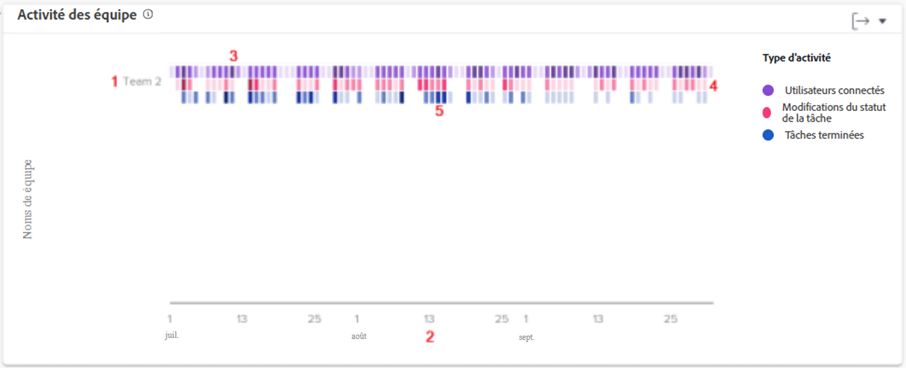

# Comprendre le graphique d’activité par équipe

Le graphique Activité par équipe vous permet de comprendre la façon dont les équipes domestiques de votre organisation passent leur temps dans Workfront. Les utilisateurs et utilisatrices de Workfront peuvent faire partie de plusieurs équipes, mais ils ne peuvent faire partie que d’une seule équipe domestique. Les équipes utilisées dans les graphiques de personnes ne sont composées que des utilisateurs et utilisatrices pour lesquels cette équipe est désignée comme équipe domestique.

Les activités (utilisateurs et utilisatrices connectés, modifications du statut de la tâche et tâches terminées) s’affichent de différentes couleurs pour résumer ces événements au cours d’une période filtrée.

Ces informations vous aident à déterminer :

* Les activités qui se produisent au sein d’une équipe domestique et leur fréquence.
* Les équipes domestiques qui sont surchargées ou utilisent davantage le système.
* Si la répartition du travail est appropriée pour l’équipe domestique.

Sur le graphique, vous pouvez voir :

1. Les noms des équipes domestiques à gauche.
1. Les dates dans la partie inférieure proviennent de la période sélectionnée.
1. Les zones violettes indiquent que les personnes affectées au projet se sont connectées ce jour-là, une nuance plus sombre indiquant un nombre plus élevé de personnes se connectant.
1. Les zones roses montrent que les personnes ont modifié le statut d’une tâche pour le projet ce jour-là, avec une nuance plus foncée indiquant un nombre plus élevé de statuts de tâche changeant.
1. Les zones bleues indiquent que les personnes ont terminé une tâche pour le projet, une nuance plus foncée indiquant un nombre plus élevé de tâches en cours d’exécution.

## Accès au graphique

1. Cliquez sur l’onglet [!UICONTROL Personnes] dans le panneau de gauche.
1. Utilisez le [!UICONTROL Filtre] pour choisir une ou plusieurs équipes locales à examiner.
1. Le graphique d’activité par équipe s’affiche en haut des graphiques des personnes.
