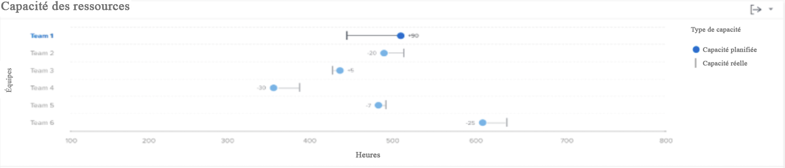

# Comprendre le graphique de la capacité des ressources

Le graphique Capacité des ressources indique le nombre d’heures planifiées affectées à une équipe d’accueil au cours de la période filtrée par rapport au nombre total d’heures disponibles de l’équipe.

Cette comparaison peut vous aider à déterminer si vous n’attribuez pas suffisamment de travail à l’équipe ou si elle est susceptible de subir une charge de travail importante. Cliquez sur le nom d’une équipe et un graphique sur les capacités de l’équipe s’affiche, indiquant plus de détails sur la capacité de l’équipe pour la période filtrée.

L’affichage de ces informations vous permet de déterminer les éléments suivants :

* Si une équipe d’accueil a été surchargée ou sous-affectée.
* Quelles équipes domestiques sont disponibles pour le travail ?

Sur le graphique, vous pouvez voir les détails clés suivants :

1. Les noms des équipes d’accueil sont à gauche.
1. Les heures sont en bas. Il s’agit de l’axe des x du graphique et calcule la plage d’heures affichée dans les équipes ci-dessus.
1. Le cercle indique le nombre d’heures planifiées affectées à l’équipe d’accueil.
1. La ligne verticale indique le nombre total d’heures disponibles pour l’équipe d’accueil.

## Utilisation du graphique

Vous devez ajouter des filtres et sélectionner une plage de dates pour afficher les données sur les graphiques du [!UICONTROL Analyse améliorée] de Workfront. Si vous avez ajouté des filtres précédemment, ils sont principaux jusqu’à ce que vous les supprimiez.

Sur le graphique Ressource en capacité , vous pouvez :

* Passez la souris sur la ligne de l’équipe d’accueil pour voir combien d’heures sont encore disponibles pour la planification, le nombre d’heures planifiées pour l’équipe d’accueil et le nombre total d’heures travaillées (désignées comme étant surpassées, sous ou à pleine capacité).
* Exportez les données du graphique à l’aide du bouton d’export situé dans le coin supérieur droit du graphique.
* Cliquez sur le nom de l&#39;équipe d&#39;accueil pour ouvrir le graphique Capacité de l&#39;équipe . Le fait de zoomer sur une période plus petite sur le graphique de capacité de l’équipe met à jour les données qui apparaissent sur le graphique de capacité des ressources.
