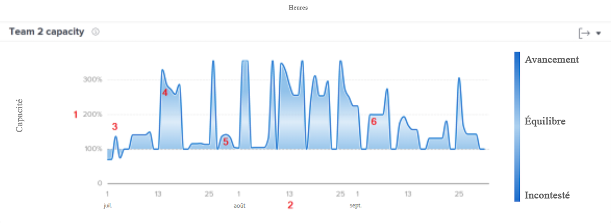
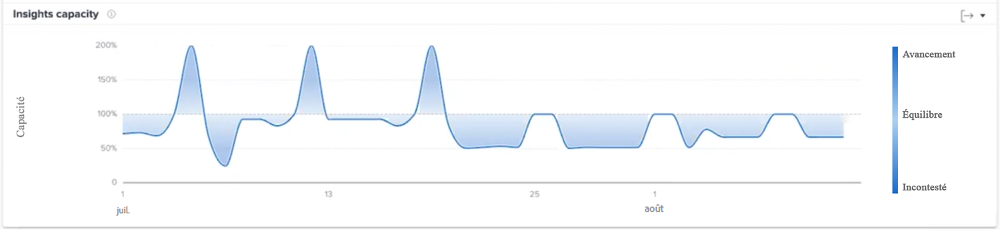

# Comprendre les capacités de l’équipe

Le graphique de capacité de l’équipe indique lorsqu’une équipe locale connaît une surattribution ou une sous-attribution. Le graphique affiche le volume de travail attribué à l’équipe locale un jour donné et attribue une couleur bleue plus foncée lorsqu’elle est proche de l’épuisement ou qu’elle n’est pas stimulée. Une couleur plus claire et plus transparente indique que la charge de travail est plus équilibrée.

Ces informations vous aident à déterminer :

* Lorsque l’équipe locale a fait l’objet d’une surattribution ou d’une sous-attribution.
* Si l’équipe locale fait quotidiennement l’objet d’une surattribution ou d’une sous-attribution.
* La cohérence de la charge de travail d’une équipe locale au quotidien.
* Si vous créez des problèmes de capacité avec un nouveau travail.

Sur le graphique, vous pouvez voir :

1. Le pourcentage de la capacité de l’équipe locale s’affiche sur la gauche.
1. Les dates dans la partie inférieure proviennent de la période sélectionnée.
1. La couleur de remplissage bleue plus foncée indique que l’équipe locale est en état d’épuisement (4) ou qu’elle n’est pas stimulée.
1. Un bleu plus clair ou plus transparent indique que la charge de travail de l’équipe locale est équilibrée.

## Accès au graphique

1. Cliquez sur l’onglet [!UICONTROL Personnes] dans le panneau de gauche.
1. Utilisez le [!UICONTROL Filtre] pour choisir une ou plusieurs équipes locales à examiner.
1. Le graphique de capacité de l’équipe s’affiche.

## Utilisation du graphique

Pour afficher des données dans les graphiques de la section Personnes de la zone Analytics, vous devez ajouter des filtres et sélectionner une période. Si vous avez déjà ajouté des filtres, ils sont actifs jusqu’à ce que vous les supprimiez.

Sur le graphique Capacité de l’équipe, vous pouvez :

* Passer la souris sur un point du graphique pour afficher la ligne de date.
* Passer la souris sur une ligne graphique pour afficher les heures planifiées et le nombre d’heures prévues pour la date donnée, ainsi que le pourcentage de capacité et si l’équipe locale était en sous-capacité, en surcapacité ou à capacité équilibrée à ce moment-là.
* Zoomer sur les dates en cliquant et en faisant glisser la souris sur un point précis du projet. (Cette action met à jour tous les autres graphiques pour effectuer un zoom avant sur la même période.)
* Exporter les données de graphique à l’aide du bouton d’export situé dans le coin supérieur droit du graphique.
