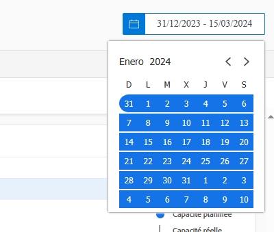
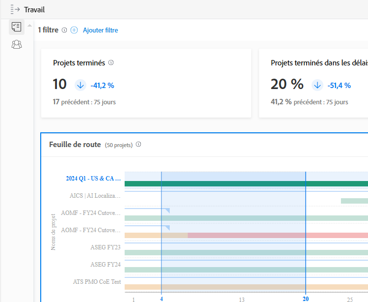

# Comprendre les périodes et les délais

Lors de l’affichage des graphiques [!DNL Enhanced analytics], les périodes sont spécifiées à l’aide du widget Calendrier. Les délais sont créés dans un graphique lorsque vous cliquez et faites glisser pour définir une région spécifique. Vous pouvez ainsi effectuer un zoom avant et obtenir un aperçu plus détaillé des informations pendant ce délai.

## Périodes

Il suffit de cliquer sur n’importe quelle date du calendrier pour indiquer une date dans votre plage, puis de cliquer sur n’importe quelle date pour indiquer l’autre extrémité de l’intervalle. Utilisez les flèches situées en haut du calendrier pour accéder à un mois différent si les dates de début et de fin ne se trouvent pas dans le même mois.

Les graphiques [!DNL Analytics] affichent par défaut les données des 60 derniers jours et des 15 prochains jours. Vous pouvez sélectionner une nouvelle période et l’appliquer à tous les graphiques lorsque vous utilisez [!DNL Analytics].

Lorsque vous actualisez la page, que vous quittez la page ou que vous vous déconnectez de Workfront, la valeur par défaut de la période est rétablie.

## Délais

Cliquez sur une section du journal et faites-la glisser pour créer un filtre de délai. Ce délai s’applique désormais à tous les graphiques de la zone de travail et apparaît à côté de tous les autres filtres dans la barre de filtre. Tirez plus d’informations d’un graphique en cliquant et en faisant glisser des zones pour mettre à jour le délai. Pour supprimer le filtre de délai, pointez sur celui-ci dans la barre de filtre et cliquez sur le X qui s’affiche.

Lorsque vous actualisez la page, que vous quittez la page ou que vous vous déconnectez de Workfront, le délai est supprimé et la période est réinitialisée.

>[!NOTE]
>
>Vous ne pouvez pas utiliser cette option de délai avec les graphiques d’arborescence du projet.
