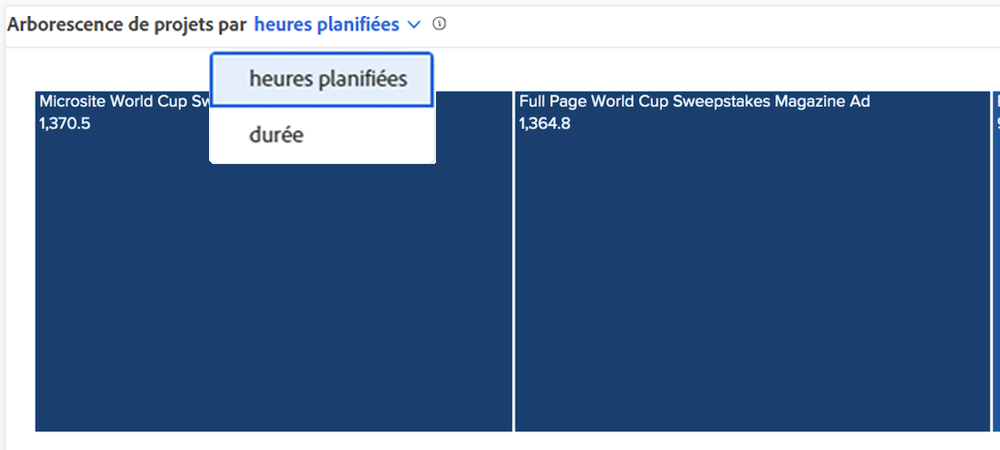

# Présentation des heures planifiées et des vues de durée

Dans les graphiques Treemap de Burndown et Project, vous pouvez afficher les informations par heures ou durée planifiées, en fonction de ce que vous considérez plus précis pour votre environnement Workfront.

La valeur par défaut Heures planifiées . Si vous passez à la durée, cela reste vrai si vous quittez la fonction [!DNL Analytics] et revenez et entre les connexions Workfront.
