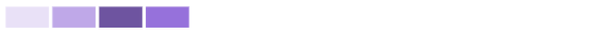

# Comprendre les actions : survoler, cliquer et faire glisser, cliquer

Dans cette vidéo, vous apprendrez :

* Comment obtenir plus d’informations en survolant un graphique
* Comment créer une période sur un graphique
* Comment faire apparaître des graphiques supplémentaires

>[!VIDEO](https://video.tv.adobe.com/v/335044/?quality=12&learn=on&enablevpops)

## Cliquer sur un graphique pour obtenir plus d’informations

Si vous cliquez sur certaines parties d’un graphique, d’autres graphiques ou une ventilation des informations du graphique s’affichent.

* **Plan de vol** : cliquez sur le nom du projet pour afficher les graphiques d’avancement et de tâches en cours.
* **Activité du projet** : cliquez sur le nom du projet pour développer le graphique et afficher l’activité du projet par utilisateur ou utilisatrice.
* **Arborescence du projet** : cliquez sur la zone d’un projet pour afficher les graphiques d’avancement et de tâches en cours.
* **Activité par équipe** : cliquez sur le nom de l’équipe pour développer le graphique afin que vous puissiez voir l’activité par utilisateur ou utilisatrice.

## Qu’est-ce qu’une nuance plus sombre et plus claire signifie en ce qui concerne l’activité d’équipe ?

**Utilisateurs et utilisatrices connectés :** les cases violettes indiquent que les personnes membres de l’équipe locale se sont connectées ce jour-là. Une nuance plus sombre indique un nombre plus élevé de personnes se connectant.

**Changement de statut d’une tâche :** les cases roses indiquent que les personnes membres de l’équipe locale ont modifié le statut d’une tâche ce jour-là. Une nuance plus foncée indique un nombre plus élevé de changements de statut d’une tâche.

**Tâches terminées :** les cases bleues indiquent que les personnes membres de l’équipe locale ont terminé une tâche ce jour-là. Une nuance plus foncée indique un nombre plus élevé de tâches terminées.

Pour plus d’informations, voir [Comprendre la visualisation de l’activité par équipe](https://experienceleague.adobe.com/docs/workfront/using/reporting/enhanced-analytics/activity-by-team-overview.html?lang=fr).
