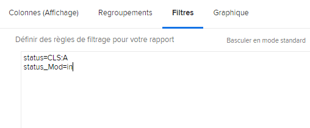

# Présentation du mode de texte de base pour les filtres

Dans cette vidéo, vous apprendrez :

* Quel mode de texte ?
* Quelle casse de chameau ?
* Un mode de texte de &quot;plug and play&quot; de base que vous pouvez utiliser dans les filtres de rapport

>[!VIDEO](https://video.tv.adobe.com/v/336820/?quality=12)

Le mode de texte suivant exclut les tâches pour lesquelles un utilisateur a marqué &quot;Terminé avec mon article&quot;. Il vous suffit de créer un filtre de tâche, d’ajouter les règles de filtrage de votre choix, puis de passer en mode texte et de coller le code ci-dessous après tout mode texte que vous voyez dans le filtre.

```
EXISTS:1:$$OBJCODE=ASSGN  
EXISTS:1:taskID=FIELD:ID  
EXISTS:1:status=DN  
EXISTS:1:status_Mod=notin  
EXISTS:1:assignedToID=$$USER.ID 
```

## Activité : Questions relatives au mode texte

1. Comment écririez-vous la casse chameau pour le champ intitulé &quot;Entré par identifiant&quot; ?
1. Dans un rapport Problème , créez un filtre pour afficher les problèmes qui ont été marqués comme fermés mais qui sont en attente d’approbation.

## Réponses

1. La casse du chameau pour le champ &quot;Entré par l’ID&quot; doit être écrite comme suit : entryByID
1. Le mode texte doit ressembler à celui-ci dans le filtre de rapport de problèmes :

   
