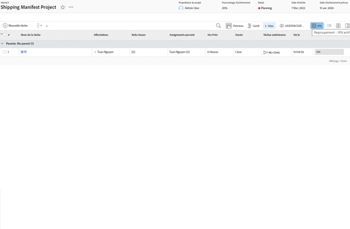
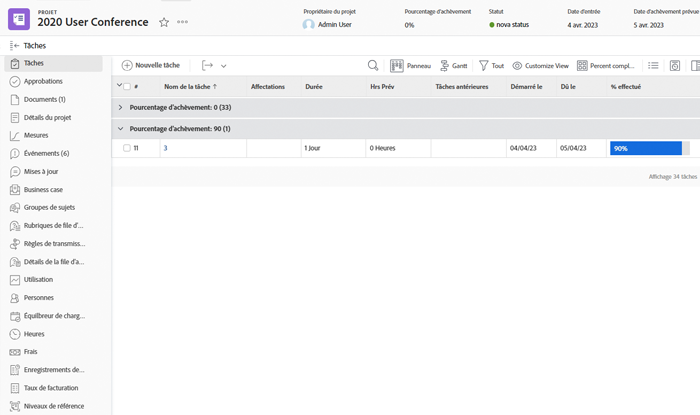
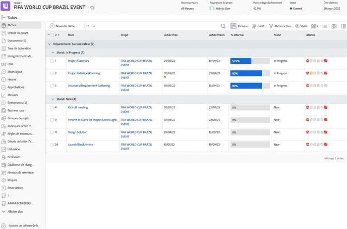
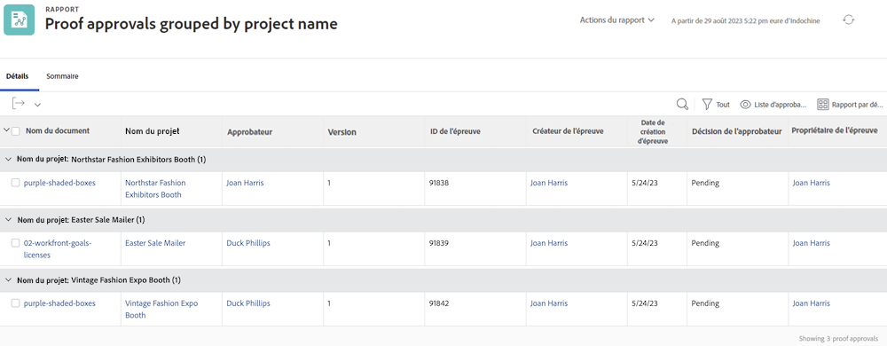
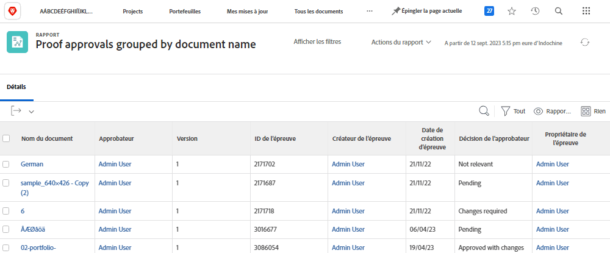

# Comprendre le mode texte de base pour les regroupements

>[!PREREQUISITES]
>
>* [Comprendre les éléments de reporting](https://experienceleague.adobe.com/docs/workfront-learn/tutorials-workfront/reporting/basic-reporting/reporting-elements.html?lang=fr)
>* [Comprendre les composants de reporting](https://experienceleague.adobe.com/docs/workfront-learn/tutorials-workfront/reporting/basic-reporting/reporting-components.html?lang=fr)
>* [Créer un regroupement de base](https://experienceleague.adobe.com/docs/workfront-learn/tutorials-workfront/reporting/basic-reporting/create-a-basic-grouping.html?lang=fr)


>[!TIP]
>
>* Pour mieux comprendre le mode texte, nous vous recommandons de regarder le webinaire enregistré [Ask the Expert - Présentation de la création de rapports en mode texte](https://experienceleague.adobe.com/fr/docs/events/classics/reporting-and-dashboards/introduction-to-text-mode-reporting), d’une durée d’une heure.
>* Pour en savoir plus sur le mode texte, nous vous recommandons de regarder les tutoriels [Reporting avancé](https://experienceleague.adobe.com/docs/workfront-learn/tutorials-workfront/reporting/advanced-reporting/welcome-to-advanced-reporting.html?lang=fr), qui durent cinq heures et demie en tout.
>* Cliquez ici pour accéder à l’[[!UICONTROL Explorateur d’API]](https://developer.adobe.com/workfront/api-explorer/).

Dans cette vidéo, vous apprendrez :

* En quoi consiste le mode texte
* En quoi consiste le camel case
* Certains _blocs de code en mode texte_ que vous pouvez utiliser dans vos regroupements de rapports.

>[!VIDEO] (https://video.tv.adobe.com/v/3410641/?quality=12&learn=on&enablevpops=0

## Activités Comprendre le mode texte de base pour les regroupements

### Tâche - Regroupement de 4 parents

Le mode texte suivant regroupe les tâches en fonction de quatre niveaux de parents au maximum et laisse les parents qui n’existent pas vides.

```
textmode=true
group.0.name=Parents
group.0.valueexpression=CONCAT({parent}.{parent}.{parent}.{parent}.{name},IF(ISBLANK({parent}.{parent}.{parent}.{parent}.{name}),"",", "),{parent}.{parent}.{parent}.{name},IF(ISBLANK({parent}.{parent}.{parent}.{name}),"",", "),{parent}.{parent}.{name},IF(ISBLANK({parent}.{parent}.{name}),"",", "),IF(ISBLANK({parent}.{name}),"No parent",{parent}.{name}))
group.0.linkedname=parent
group.0.namekeyargkey.0=parent
group.0.namekeyargkey.1=name
group.0.valueformat=string
```




### Tâche - Regroupement en pourcentage terminé

Le mode texte suivant regroupe les tâches en fonction de leur pourcentage terminé. Les tâches sont regroupées dans l’une des catégories suivantes :

* 0%
* 1 à 25 %
* 26 à 50 %
* 51 à 75 %
* 76 à 99 %
* 100%

```
group.0.linkedname=direct
group.0.namekey=percentComplete
group.0.valueexpression=IF({percentComplete}<1,"0%",IF({percentComplete}<26,"1% to 25%",IF({percentComplete}<51,"26% to 50%",IF({percentComplete}<76,"51% to 75%",IF({percentComplete}<100,"76% to 99%",IF({percentComplete}=100,"100","***"))))))
group.0.valueformat=doubleAsString
textmode=true
```



### Tâche - statusEquatesWith, puis statut

Le mode texte suivant regroupe les tâches par statusEquatesWith, puis par statut.

```
group.0.enumclass=com.attask.common.constants.TaskStatusEnum
group.0.enumtype=TASK
group.0.linkedname=direct
group.0.name=State
group.0.type=enum
group.0.valuefield=statusEquatesWith
group.0.valueformat=val
group.1.enumclass=com.attask.common.constants.TaskStatusEnum
group.1.enumtype=TASK
group.1.linkedname=direct
group.1.namekey=status
group.1.type=enum
group.1.valuefield=status
group.1.valueformat=val
textmode=true
```




### Approbation de BAT - Regroupement par nom de projet

```
group.0.valueformat=HTML
group.0.valuefield=documentVersion:document:project:name
group.0.displayname=Project Name
```




### Approbation de BAT - Regroupement par nom de document

```
group.0.displayname=Document Name
group.0.valuefield=documentVersion:document:name
group.0.valueformat=HTML
```



