# Comprendre le mode texte de base pour les vues


>[!IMPORTANT]
>
>Prérequis :
>
>* [Comprendre les éléments de reporting](https://experienceleague.adobe.com/docs/workfront-learn/tutorials-workfront/reporting/basic-reporting/reporting-elements.html?lang=fr)
>* [Comprendre les composants de reporting](https://experienceleague.adobe.com/docs/workfront-learn/tutorials-workfront/reporting/basic-reporting/reporting-components.html?lang=fr)
>* [Créer une vue de base](https://experienceleague.adobe.com/docs/workfront-learn/tutorials-workfront/reporting/basic-reporting/create-a-basic-view.html?lang=fr)

>[!TIP]
>
>* Pour mieux comprendre le mode texte, nous vous recommandons de regarder le webinaire enregistré [Ask the Expert - Présentation du reporting en mode texte](https://experienceleague.adobe.com/docs/workfront-events/events/reporting-and-dashboards/introduction-to-text-mode-reporting.html?lang=fr), d’une durée d’une heure.
>* Pour en savoir plus sur le mode texte, nous vous recommandons de regarder les tutoriels [Reporting avancé](https://experienceleague.adobe.com/docs/workfront-learn/tutorials-workfront/reporting/advanced-reporting/welcome-to-advanced-reporting.html?lang=fr), qui durent cinq heures et demie en tout.
>* Cliquez ici pour accéder à l’[[!UICONTROL Explorateur d’API]](https://developer.adobe.com/workfront/api-explorer/).

Dans cette vidéo, vous apprendrez :

* En quoi consiste le mode texte
* En quoi consiste le camel case
* Un mode texte « plug and play » de base que vous pouvez utiliser dans vos vues

>[!VIDEO](https://video.tv.adobe.com/v/3410571/?quality=12&learn=on)

## Tâche - Vue 4 parents

Créez d’abord une colonne pour le Nom de la tâche et le Nom du parent, puis utilisez le mode texte suivant pour créer les trois autres colonnes.

### Tâche - Nom du parent du parent

```
displayname=Parent of Parent Name
linkedname=parent
namekey=view.relatedcolumn
namekeyargkey.0=parent
namekeyargkey.1=name
querysort=parent:parent:name
textmode=true
valuefield=parent:parent:name
valueformat=HTML
```

### Tâche - Nom du parent du parent du parent

```
displayname=Parent of Parent of Parent Name
linkedname=parent
namekey=view.relatedcolumn
namekeyargkey.0=parent
namekeyargkey.1=name
querysort=parent:parent:parent:name
textmode=true
valuefield=parent:parent:parent:name
valueformat=HTML
```

### Tâche - Nom du parent du parent du parent du parent

```
displayname=Parent of Parent of Parent of Parent Name
linkedname=parent
namekey=view.relatedcolumn
namekeyargkey.0=parent
namekeyargkey.1=name
querysort=parent:parent:parent:parent:name
textmode=true
valuefield=parent:parent:parent:parent:name
valueformat=HTML
```


## Utilisateur ou utilisatrice : itérations affichant des listes dans les vues d’utilisateur

### Utilisateur ou utilisatrice : toutes les fonctions

```
displayname=All job roles
listdelimiter=<p>
listmethod=nested(userRoles).lists
textmode=true
type=iterate
valuefield=role:name
valueformat=HTML
```

### Utilisateur ou utilisatrice : toutes les fonctions présentant l’affichage principal

```
displayname=All Job Roles showing primary
listdelimiter=<p> 
listmethod=nested(userRoles).lists 
textmode=true
type=iterate 
valueexpression=IF({user}.{roleID}={role}.{ID},CONCAT("** ",{role}.{name}," **"),{role}.{name})
valueformat=HTML
```

### Utilisateur ou utilisatrice : toutes les équipes

```
displayname=All teams
listdelimiter=<p>
listmethod=nested(teams).lists
textmode=true
type=iterate
valueexpression={name}
valueformat=HTML
```

>[!NOTE]
>
>Un champ Équipe est accessible par le biais de l’interface utilisateur. Il affiche toutes les équipes, séparées par des virgules, mais l’utilisation du mode texte ci-dessus affiche chaque équipe sur une ligne distincte.


### Utilisateur ou utilisatrice : tous les groupes

```
displayname=All groups
listdelimiter=<p>
listmethod=nested(userGroups).lists
textmode=true
type=iterate
valuefield=group:name
valueformat=HTML
```

### Utilisateur ou utilisatrice : tous les groupes affichant le groupe d’accueil

```
displayname=All groups showing home group
listdelimiter=<p>
listmethod=nested(userGroups).lists
textmode=true
type=iterate
valueexpression=IF({user}.{homeGroupID}={group}.{ID},CONCAT("** ",{group}.{name}," **"),{group}.{name})
valueformat=HTML
```


### Utilisateur ou utilisatrice : subordonnés directs

```
displayname=Direct reports
listdelimiter=<p>
listmethod=nested(directReports).lists
textmode=true
type=iterate
valueexpression={name}
valueformat=HTML
```

### Utilisateur ou utilisatrice : congés futurs

```
displayname=Future PTO
listdelimiter=<br>
listmethod=nested(reservedTimes).lists
namekey=group.plural
textmode=true
type=iterate
valueexpression=IF({startDate}>$$TODAY,CONCAT({startDate}," - ",{endDate}),"")
valueformat=HTML
width=150
```

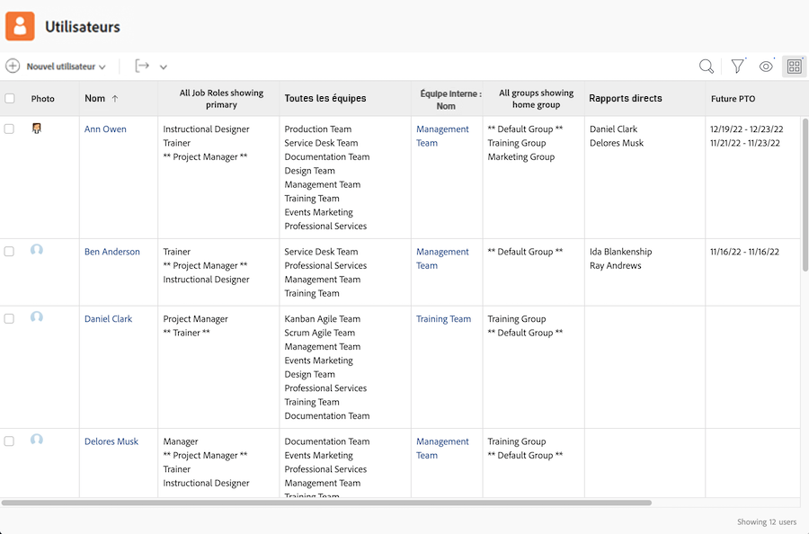

## Tâche : affichage des affectations de tâche et utilisation du statut

```
displayname=Assignments and Status
listdelimiter=<br>
listmethod=nested(assignments).lists
namekey=group.plural
textmode=true
type=iterate
valueexpression=CONCAT({assignedTo}.{name},IF(ISBLANK({assignedTo}.{name}),"",IF({status}="AA"," - Requested",IF({status}="AD"," - Working"," - Done"))))
valueformat=HTML
width=150
```

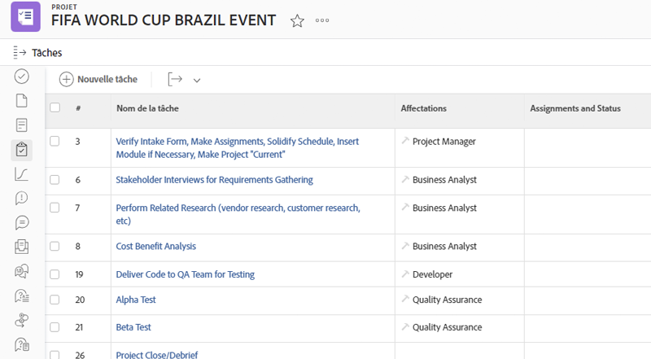


## Tâche : affichage du rôle et de l’attribution sur plusieurs affectations de tâche

### Tâche : rôle + heures

```
displayname=Role+hours
listdelimiter=<li>
listmethod=nested(assignments).lists
textmode=true
type=iterate
valueexpression=CONCAT({role}.{name}," (",round({workRequired}/60,2),")")
valueformat=HTML
```

### Tâche : affectation + pourcentage d’affectation

```
displayname=Assignment+percent
valueexpression=CONCAT({assignedTo}.{name}," (",{assignmentPercent},")")
listdelimiter=<li>
listmethod=nested(assignments).lists
valueformat=HTML
textmode=true
type=iterate
```

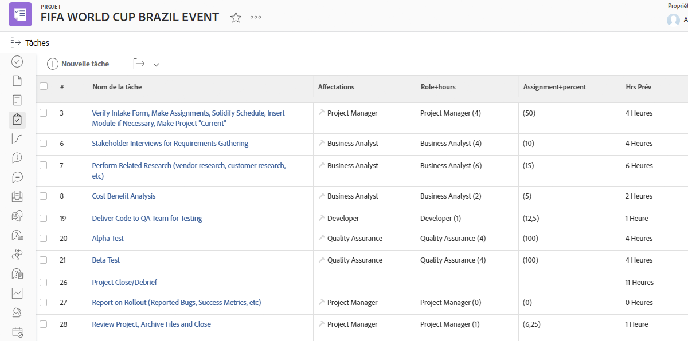

## Tâches : prédécesseurs et successeurs sur plusieurs projets

### Filtre de tâche (facultatif)

**Me montrer toutes les tâches ayant au moins un prédécesseur sur plusieurs projets ou au moins un successeur sur plusieurs projets sur les projets en cours**

```
predecessorsMM:ID_Mod=notblank
predecessorsMM:projectID=FIELD:projectID
predecessorsMM:projectID_Mod=ne
project:statusEquatesWith=CUR
project:statusEquatesWith_Mod=in
OR:1:project:statusEquatesWith=CUR
OR:1:project:statusEquatesWith_Mod=in
OR:1:successorsMM:ID_Mod=notblank
OR:1:successorsMM:projectID=FIELD:projectID
OR:1:successorsMM:projectID_Mod=ne
```

### Tâche : afficher les noms des prédécesseurs et le projet dans lequel est le prédécesseur

```
displayname=Predecessor names
listdelimiter=<br>
listmethod=nested(predecessors).lists
namekey=group.plural
textmode=true
type=iterate
valueexpression=CONCAT("TASK = ",{predecessor}.{name}," >> PROJECT = ",{predecessor}.{project}.{name})
valueformat=HTML
width=150
```

### Tâche : afficher les noms des successeurs et le projet dans lequel est le successeur

```
displayname=Successor names
listdelimiter=<br>
listmethod=nested(successors).lists
namekey=group.plural
textmode=true
type=iterate
valueexpression=CONCAT("TASK = ",{successor}.{name}," >> PROJECT = ",{successor}.{project}.{name})
valueformat=HTML
width=150
```

### Tâche : afficher la date d’achèvement prévue des prédécesseurs

```
displayname=Predecessor projected completion dates
valueformat=atDate
listdelimiter=
textmode=true
width=90
stretch=0
valuefield=predecessor:projectedCompletionDate
type=iterate
listmethod=nested(predecessors).lists
shortview=false
```

### Tâche : afficher le statut de la progression des prédécesseurs

```
displayname=Predecessor progress status
listdelimiter=<br>
listmethod=nested(predecessors).lists
shortview=false
stretch=0
textmode=true
type=iterate
valueexpression=IF({predecessor}.{progressStatus}="OT","On Time",IF({predecessor}.{progressStatus}="LT","Late",IF({predecessor}.{progressStatus}="BH","Behind","At Risk")))
valueformat=HTML
width=90
```

### Tâche : afficher le pourcentage d’achèvement du projet du prédécesseur sur plusieurs projets

```
displayname=Predecessor project percent complete
listdelimiter=<br>
listmethod=nested(predecessors).lists
namekey=group.plural
textmode=true
type=iterate
valueexpression=IF({isCP}=true,CONCAT({predecessor}.{project}.{percentComplete},"%"),"")
valueformat=HTML
width=150
```

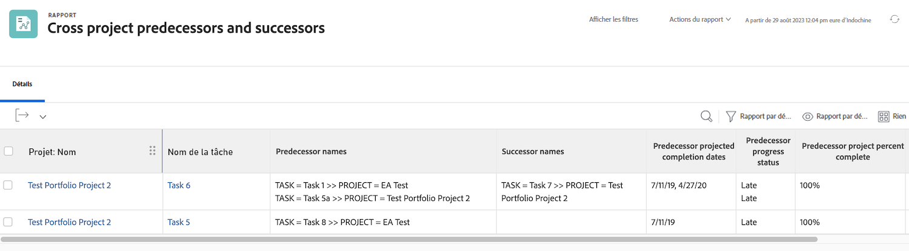


## Tâche : itération montrant toutes les personnes affectées et qui a affecté chacune d’elles

```
displayname=All assignees and requesters
listdelimiter=<p>
listmethod=nested(assignments).lists
textmode=true
type=iterate
valueexpression=CONCAT("Assigned To: ",{assignedTo}.{name},"; Requested By: ",{assignedBy}.{name})
valueformat=HTML
```

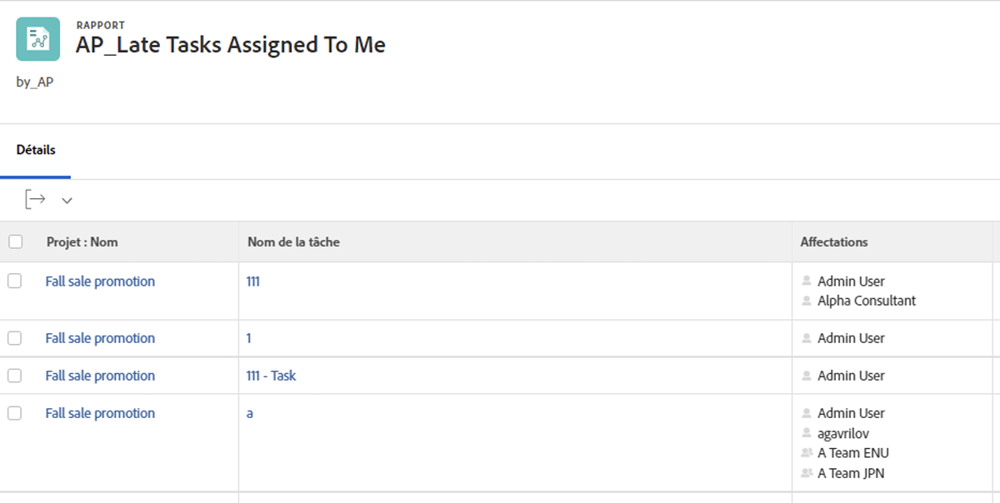

## Tâche/projet : itération montrant tous les formulaires personnalisés sur un projet ou une tâche

```
displayname=All Forms Assigned
listdelimiter=<p>
listmethod=nested(objectCategories).lists
textmode=true
type=iterate
valuefield=category:name
valueformat=HTML
```

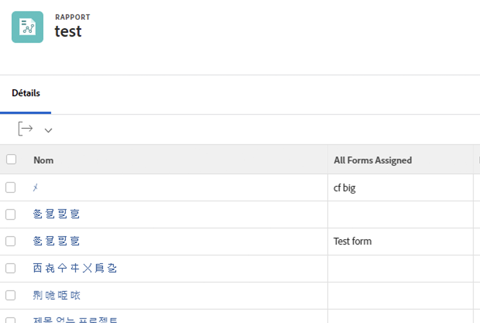


## Projet : itération montrant tous les contacts principaux pour les éléments à résoudre dans la vue projet

```
displayname=Requestor
listdelimiter=<br>
listmethod=nested(resolvables).lists
namekey=group.plural
textmode=true
type=iterate
valuefield=owner:name
valueformat=HTML
width=150
```


## Projet : itération présentant tous les membres de l’équipe de projet

```
displayname=Project Team Members
listdelimiter=<br>
listmethod=nested(projectUsers).lists
namekey=group.plural
textmode=true
type=iterate
valuefield=user:name
valueformat=HTML
```

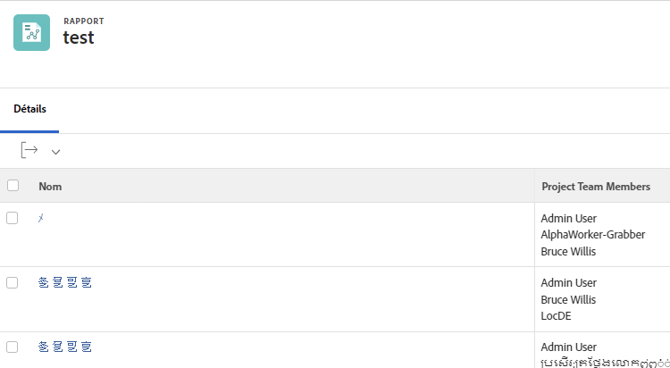

## Projet : itération indiquant entryDate de tous les problèmes résolvables d’un projet.

```
displayname=Resolvables entry date
linkedname=direct
listdelimiter=<br>
listmethod=nested(project.resolvables).lists
listsort=string(description)
querysort=description
section=0
textmode=true
type=iterate
valuefield=entryDate
valueformat=HTML
```

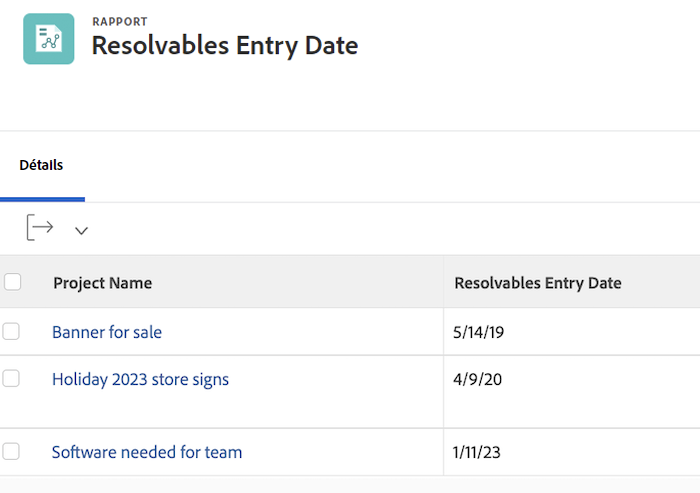

## Projet : afficher le groupe d’accueil de la personne ayant demandé le projet d’origine.

```
displayname=Requestor home group
linkedname=direct
namekey=name
querysort=convertedOpTaskOriginator:homeGroup:name
textmode=true
valuefield=convertedOpTaskOriginator:homeGroup:name
valueformat=HTML
```

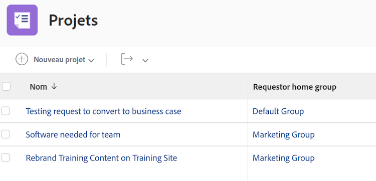

## Projet : indiquer si le projet est une file d’attente des demandes.

```
querysort=queueDef:isPublic
valueformat=val
description=0 (None), 1 (Public), 2 (Private), 3 (Company), 4 (Group)
linkedname=direct
textmode=true
enumtype=PROJ
valuefield=queueDef:isPublic
namekey=status
type=enum
enumclass=com.attask.common.constants.ProjectStatusEnum
displayname=Public Selection
```

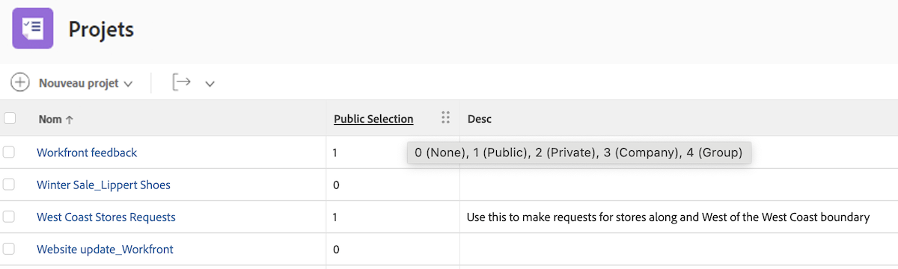

## Problème : itération indiquant tous les membres de l’équipe de projets de résolution.

```
displayname=Resolve Project: Team Members
listdelimiter=<br>
listmethod=nested(resolveProject.projectUsers).lists
namekey=group.plural
textmode=true
type=iterate
valuefield=user:name
valueformat=HTML
width=150
```

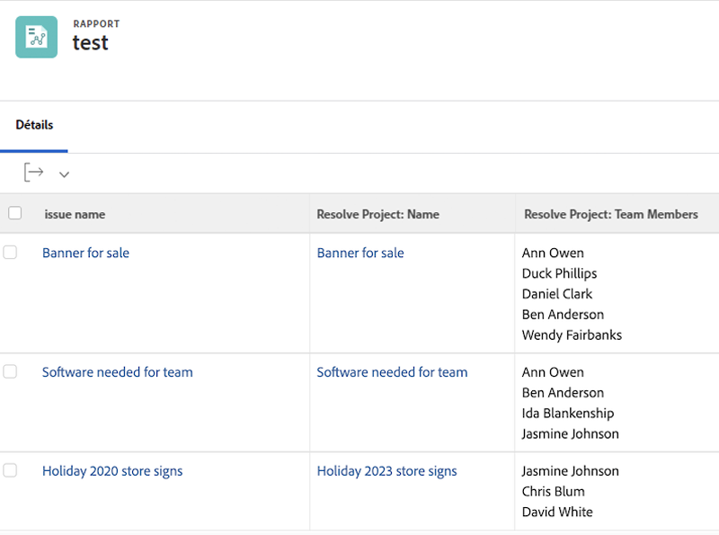

## Problème : itération montrant toutes les équipes du contact principal du problème.

```
displayname=Requestor Teams
listdelimiter=<br>
listmethod=nested(owner.teams).lists
namekey=group.plural
textmode=true
type=iterate
valuefield=name
valueformat=HTML
width=150
```

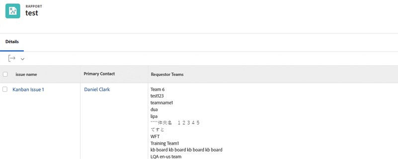

## Document : itération affichant le dossier dans un rapport de document.

```
displayname=Folder
listdelimiter=<br><br>
listmethod=nested(folders).lists
textmode=true
type=iterate
valuefield=name
valueformat=HTML
```

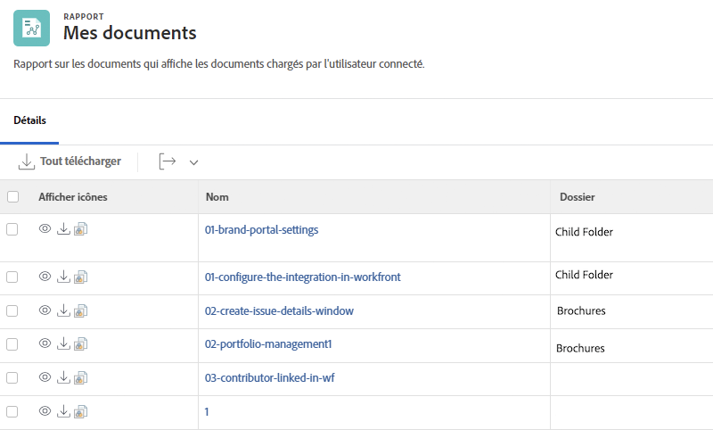

## Document : itération affichant le dossier parent dans un rapport de document.

```
displayname=Parent Folder
listdelimiter=<br><br>
listmethod=nested(folders).lists
textmode=true
type=iterate
valuefield=parent:name
valueformat=HTML
```


## Document : dates de validation du document.

```
displayname=Document approval dates
valueformat=HTML
listdelimiter=<br>
linkedname=direct
textmode=true
listsort=string(description)
valuefield=approvalDate
type=iterate
listmethod=nested(approvals).lists
shortview=false
section=0
```

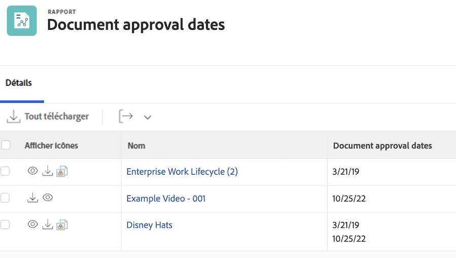

## Approbations d&#39;épreuve

### Approbation du BAT : afficher le nom du projet.

```
displayname=Project Name
textmode=true 
valuefield=documentVersion:document:project:name 
valueformat=HTML
```

### Approbation du BAT : afficher le nom de la tâche.

```
displayname=Task Name
textmode=true 
valuefield=documentVersion:document:task:name 
valueformat=HTML
```

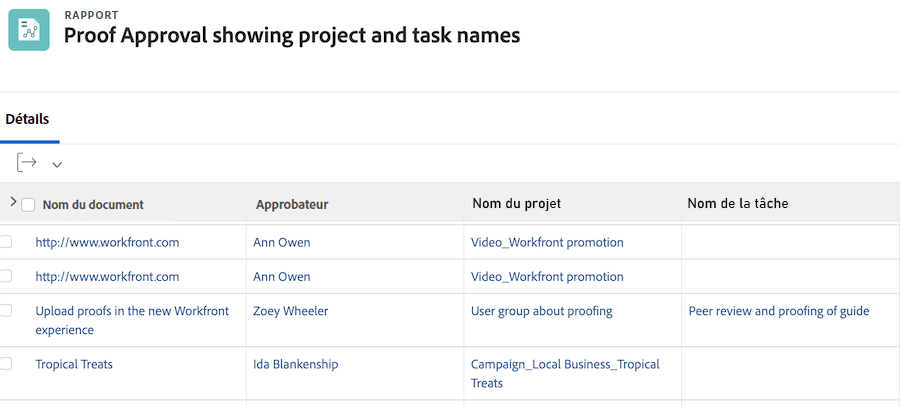
