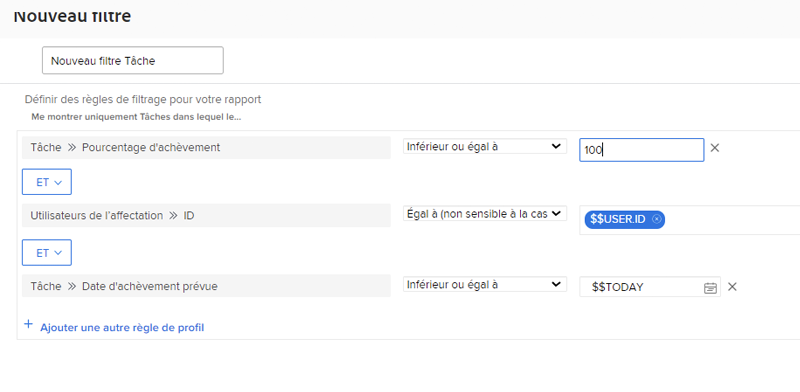

# Créer des filtres avec des caractères génériques basés sur la date

Dans cette vidéo, vous apprendrez à :

* Présentation des caractères génériques basés sur la date
* Comprendre la différence entre les deux caractères génériques Workfront basés sur la date
* Ajouter un caractère générique basé sur la date à un filtre
* Créer une date personnalisée à l’aide de caractères génériques, d’attributs, d’opérateurs et de modificateurs
* Créer une période personnalisée à l’aide de caractères génériques

>[!VIDEO](https://video.tv.adobe.com/v/336812/?quality=12&learn=on)

## Activité Créer des filtres avec des caractères génériques basés sur la date

### Questions d’activité

1. Quelle serait la règle de filtrage pour que les problèmes aient une échéance à la date d’hier ou d’aujourd’hui ?
1. Quelle serait la règle de filtrage pour trouver les projets arrivés à échéance la semaine dernière ?
1. Les règles de filtrage suivantes font partie d’un rapport de tâches que vous utilisez régulièrement. Quel type de résultats obtiendriez-vous de ce rapport ?

### Réponses

1. Filtrage de la date d’achèvement prévue du problème entre [!UICONTROL $$TODAY-1d] et [!UICONTROL $$TODAY].
1. Filtrage de la date de fin prévue du projet entre [!UICONTROL $$TODAYb-1w] et [!UICONTROL $$TODAYe-1w].
1. Ce rapport recherche les tâches qui vous ont été affectées et qui ne sont pas encore terminées (en d’autres termes, dont le pourcentage de réalisation est inférieur à 100), et qui sont en retard ou qui doivent être terminées aujourd’hui. La règle de filtrage de la date d’achèvement prévue des tâches indique d’examiner les tâches dont la date d’échéance est égale ou antérieure à la date du jour.
