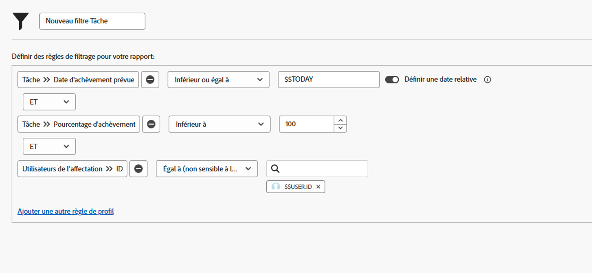

# Création de filtres avec des caractères génériques basés sur la date

Dans cette vidéo, vous apprendrez à :

* Savoir quand utiliser des caractères génériques basés sur des dates
* Comprendre la différence entre les deux caractères génériques Workfront basés sur des dates
* Ajout d’un caractère générique basé sur les dates à un filtre
* Création d’une date personnalisée à l’aide de caractères génériques, d’attributs, d’opérateurs et de modificateurs
* Création d’une période personnalisée à l’aide de caractères génériques

>[!VIDEO](https://video.tv.adobe.com/v/336812/?quality=12&learn=on)

## Questions d’activité

1. Comment créer la règle de filtrage si vous souhaitez des problèmes dont la date d’hier ou d’aujourd’hui est échue ?
1. Comment créeriez-vous la règle de filtrage pour trouver les projets qui devaient être réalisés la semaine dernière ?
1. Les règles de filtrage suivantes font partie d’un rapport de tâche que vous utilisez régulièrement. Quel type de résultats obtiendriez-vous de ce rapport ?

## Réponses

1. Filtrage de la date d’achèvement prévue du problème entre [!UICONTROL $$TODAY-1d] et [!UICONTROL $$AUJOURD’HUI].
1. Filtrage de la date de fin prévue du projet entre [!UICONTROL $$TODAYb-1w] et [!UICONTROL $$TODAYe-1w].
1. Ce rapport répertorie les tâches qui vous ont été affectées et qui ne sont pas encore terminées (c’est-à-dire dont le pourcentage est inférieur à 100), et qui sont en retard ou qui doivent être exécutées aujourd’hui. La règle de filtrage de la date d’achèvement prévue des tâches indique d’examiner les tâches dont la date d’échéance est égale ou antérieure à la date d’aujourd’hui.
