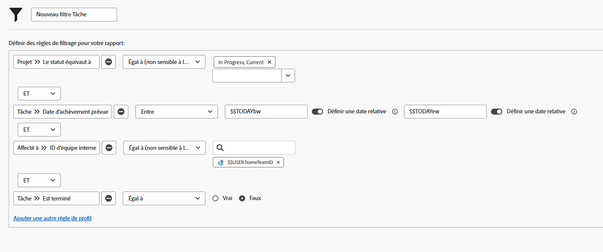

# Créer des filtres avec des caractères génériques basés sur l’utilisateur ou l’utilisatrice

Dans cette vidéo, vous apprendrez à :

* Comprendre pourquoi utiliser des caractères génériques
* Créer un filtre avec un caractère générique basé sur l’utilisateur ou l’utilisatrice

>[!VIDEO](https://video.tv.adobe.com/v/336810/?quality=12&learn=on)

>[!TIP]
>
>Utilisez la source et le nom du champ Utilisateurs de l’affectation >> ID lorsque vous créez des filtres qui examinent les informations relatives à l’affectation des tâches ou des problèmes.  Cette option permet d’examiner les utilisateurs et les utilisatrices affectés à la tâche ou au problème, et pas seulement le ou la « propriétaire » ou la personne désignée principale.

>[!TIP]
>
>Utilisez l’identifiant $$USER.ID (au lieu de votre nom), même lorsque vous créez des filtres pour vous-même. Ainsi, si quelqu’un voit un filtre que vous utilisez et demande : « partagez-le avec moi », le filtre est déjà configuré de sorte que chaque personne qui l’utilise voie ses propres informations.

>[!TIP]
>
>Vous devez toujours utiliser le qualificatif de filtre Égal lorsque vous utilisez des caractères génériques basés sur l’utilisateur ou l’utilisatrice.

## Activités « Créer des filtres avec des caractères génériques basés sur l’utilisateur »

### Activité 1

Vous disposez d’un peu de temps supplémentaire cette semaine, vous voulez donc voir si une personne de votre équipe a besoin d’aide pour réaliser ses tâches. Créez un filtre de tâche pour trouver les tâches qui arrivent à échéance cette semaine et qui ne sont pas terminées.

### Réponse 1

Merci infiniment d’aider les personnes de votre équipe ! Lorsque le filtre est configuré comme dans l’image ci-dessous, vous trouverez les tâches suivantes :

* les tâches qui n’ont pas été achevées (ce qui signifie qu’elles n’ont pas le statut [!UICONTROL Terminé] ou un statut équivalent) ;
* les tâches qui se trouvent dans des projets dont le statut est [!UICONTROL En cours] (le but n’est pas de trouver des tâches pour des projets qui n’ont pas encore été lancés) ;
* Les tâches qui sont affectées à une personne de votre équipe d’origine, tel que défini par les paramètres d’équipe Workfront ;
* et les tâches dont la date d’achèvement est prévue pour cette semaine (cette règle utilise le filtre de date prédéfinie, réglé sur « cette semaine »).

Vous devrez peut-être ajouter des filtres supplémentaires pour restreindre un peu plus la liste. Par exemple, vous voudrez peut-être ajouter une règle de filtrage qui concerne un programme ou un portfolio spécifique avec lesquels votre équipe travaille.
