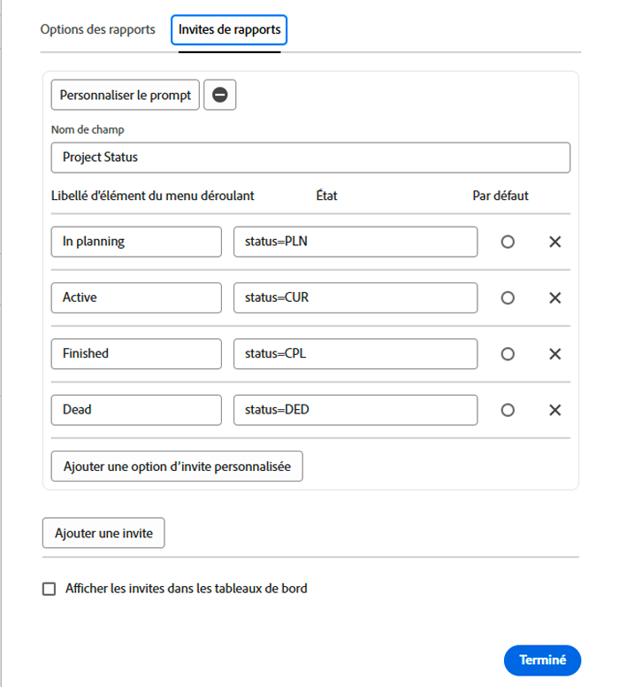

# Créer des invites personnalisées

Dans cette vidéo, vous apprendrez :

* En quoi consiste une invite personnalisée
* Comment créer une invite personnalisée en mode texte
* Des exemples que vous pouvez utiliser dans vos rapports

>[!VIDEO](https://video.tv.adobe.com/v/336822/?quality=12&learn=on)

## Créer des activités d’invites personnalisées

Pour télécharger un fichier PDF de cette page, [cliquez ici](/help/assets/create-custom-prompts-activities.pdf).

## Activité : création d’invites personnalisées

1. Créez une invite personnalisée qui affiche les statuts de projet suivants dans le menu déroulant de l’invite :
   * Planification
   * Actuel
   * Terminé
   * Immobilisé
1. Modifiez l’invite pour afficher les projets en cours qui doivent être exécutés ce mois-ci.

## Réponses

1. Les invites personnalisées doivent ressembler à ceci et présenter le mode texte suivant :

   

   Une fois que vous avez enregistré l’invite personnalisée, le menu déroulant de l’invite doit se présenter comme suit :

1. Le mode texte de votre invite personnalisée doit se présenter comme suit :


```
   status=CUR&plannedCompletionDate=$$TODAYbm&plannedCompletionDate_Mod=between&plannedCompletionDate_Range=$$TODAYem 
```

Le libellé de la liste déroulante des invites actives doit être mis à jour pour refléter le changement du code comme ceci :


