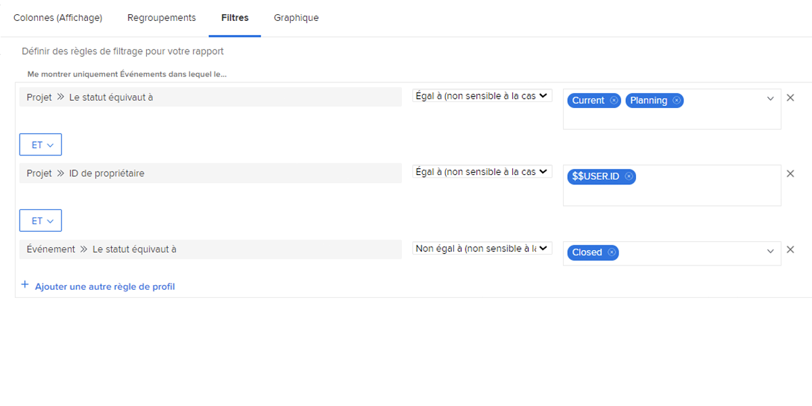
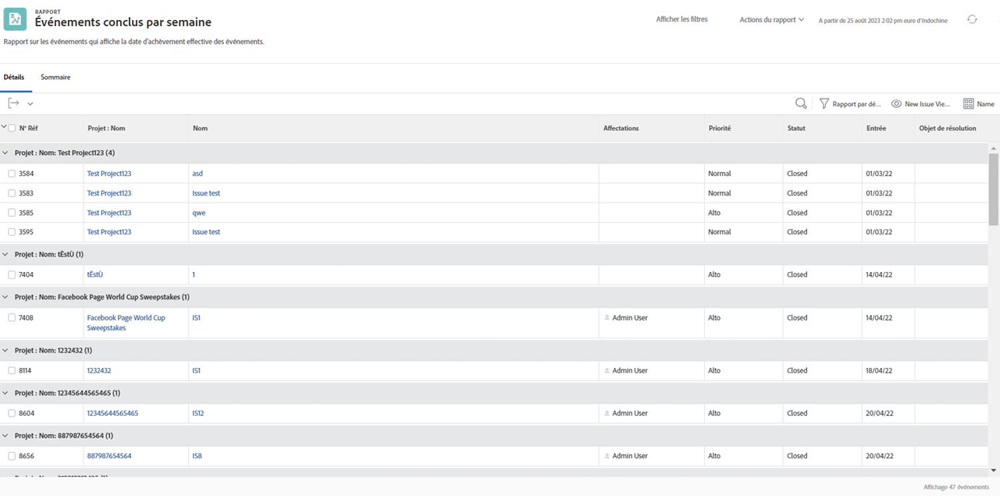

# Comprendre les filtres de problèmes intégrés

Dans cette vidéo, vous allez :

* Examiner les filtres de problèmes intégrés pour déterminer comment ils sont construits
* Découvrir quelques éléments utiles de reporting de problèmes
* Apprendre à créer votre propre filtre de problèmes

>[!VIDEO](https://video.tv.adobe.com/v/336819/?quality=12&learn=on&enablevpops=0)

## Activités Comprendre les filtres de problèmes intégrés

### Activité : créer un rapport de problème

Vous voulez voir tous les problèmes qui doivent encore être résolus sur tous les projets actifs que vous possédez, y compris les problèmes avec un objet de résolution. Créez un rapport de problème et nommez-le « Problèmes non résolus sur les projets dont je suis propriétaire ».

### Réponse

Voici à quoi devrait ressembler le filtre :

Dans le filtre intégré « Mes problèmes ouverts », l’une des règles de filtrage excluait tous les problèmes pour lesquels il existait un objet de résolution. La raison en est que vous n’avez pas à vous préoccuper de ces problèmes. Une personne a déjà créé un projet, une tâche ou un problème qui les résoudra, alors pourquoi s’inquiéter ? Mais ils ne sont pas encore résolus et, dans notre exemple, nous les incluons pour qu’ils soient faciles à identifier et à vérifier.

Pour ce faire, vous devez ajouter une colonne dans l’onglet de vue « Problème > Objet de résolution ». Cela indique le nom de l’objet de résolution, s’il y en a un, qu’il s’agisse d’un projet, d’une tâche ou d’un problème. Cliquez sur le nom pour accéder à l’objet de résolution.

Vous pouvez regrouper la liste en fonction du nom du projet.

Voici à quoi devrait ressembler le rapport :

