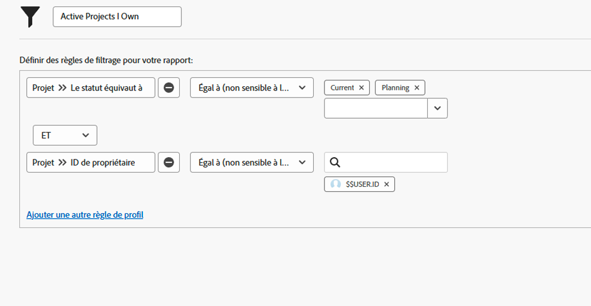

# Comprendre les filtres de projet intégrés

Dans cette vidéo, vous apprendrez à :

* Examiner les filtres de projet intégrés pour voir comment ils sont créés
* Créer votre propre filtre de projet en utilisant ce que vous avez appris

>[!VIDEO](https://video.tv.adobe.com/v/336817/?quality=12&learn=on)

## Activités Comprendre les filtres de projets intégrés

### Activité : créer un filtre de projet

Vous voulez voir tous les projets actifs que vous possédez, où « actif » signifie que le statut du projet équivaut à Planification ou En cours. Dans la zone Projets, créez un filtre de projet intitulé « Projets actifs dont je suis propriétaire ».

### Réponse

Votre filtre devrait ressembler à ceci :

Vous pouvez inclure des règles de filtrage supplémentaires, telles que la recherche de projets dans un certain programme ou portfolio. Lorsque vous faites cela, Workfront vous recommande de renommer le filtre en quelque chose de suffisamment descriptif, comme « Projets actifs dont je suis propriétaire dans le portfolio marketing ».
