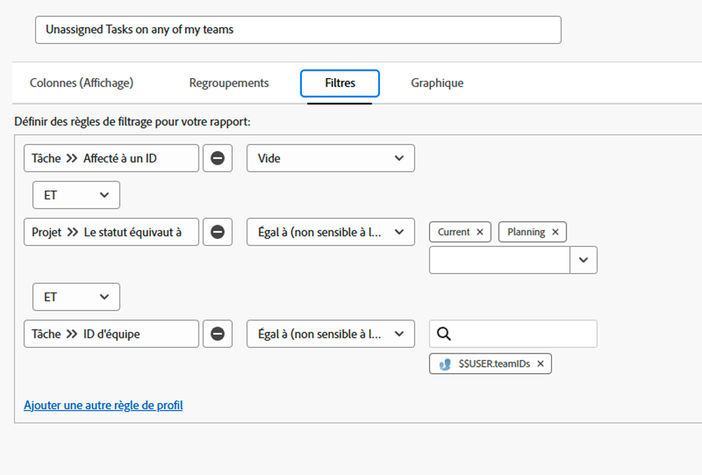

# Comprendre les filtres de tâches intégrés

Dans cette vidéo, vous allez :

* Examiner les filtres de tâches intégrés pour comprendre comment ils sont construits
* En savoir plus sur certains éléments utiles de reporting de tâches
* Découvrir comment créer votre propre filtre de tâche

>[!VIDEO](https://video.tv.adobe.com/v/3412672/?quality=12&learn=on&captions=fre_fr)

## Activités Comprendre les filtres de tâches intégrés

### Activité : création d’un rapport de tâche

Vous voulez vous assurer que vous êtes au courant des tâches assignées à l&#39;une de vos équipes et pour lesquelles personne n’a encore accepté de travailler. Créez un rapport de tâche nommé « Tâches non assignées à l’une de mes équipes ».

### Réponse

Voici à quoi devrait ressembler le filtre :

Configurez votre vue en colonnes pour inclure les champs qui vous intéressent ou que vous souhaitez pouvoir modifier en ligne. Par exemple, vous pouvez inclure une colonne Affectations afin d’attribuer une tâche à un membre de l’équipe directement depuis le rapport.

Vous pouvez regrouper la liste en fonction du nom de l’équipe affectée à chaque tâche.

Voici à quoi peut ressembler le rapport :

