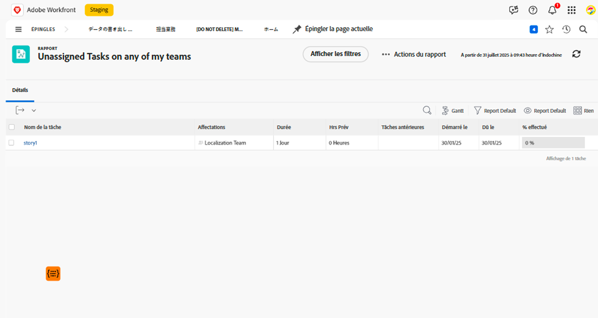

# Présentation des filtres de tâche intégrés

Dans cette vidéo, vous allez :

* Examinez les filtres de tâche intégrés pour voir comment ils sont créés.
* En savoir plus sur certains éléments utiles de reporting de tâches
* Découvrez comment créer votre propre filtre de tâche

>[!VIDEO](https://video.tv.adobe.com/v/336818/?quality=12)

## Activité : Créer un rapport de tâche

Vous voulez vous assurer que vous êtes au courant des tâches assignées à l’une de vos équipes que personne n’a encore accepté de travailler dessus. Créez un rapport de tâche nommé &quot;Tâches non assignées sur l’une de mes équipes&quot;.

## Réponse

Voici à quoi doit ressembler le filtre :

Configurez le mode Colonnes pour inclure les champs qui vous intéressent ou qui souhaitent pouvoir être modifiés en ligne. Par exemple, vous pouvez inclure une colonne Affectations afin d’affecter un membre de l’équipe à une tâche directement depuis le rapport.

Vous pouvez regrouper la liste en fonction du nom de l’équipe affectée à chaque tâche.

Voici à quoi devrait ressembler le rapport :

