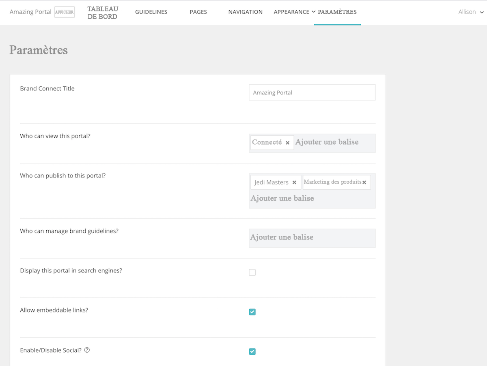

# Définition des paramètres système dans [!UICONTROL Brand Connect]

Le [!UICONTROL Brand Connect] les paramètres contrôlent qui peut voir le portail, qui peut publier du contenu sur le portail et qui peut gérer les directives sur la marque.

Pour accéder aux paramètres, connectez-vous à [!UICONTROL Gestion des actifs numériques Workfront].

1. Cliquez sur le bouton **icône paramètres** dans la barre de navigation et sélectionnez **[!UICONTROL Brand Connect]**. Ou cliquez sur **[!UICONTROL Marques]** dans la barre de navigation.
1. Cliquez ensuite sur le bouton **[!UICONTROL Modifier]** dans le coin supérieur droit de la [!UICONTROL Brand Connect] du panneau. Si votre organisation comporte plusieurs [!UICONTROL Brand Connectors], assurez-vous que vous modifiez la bonne version.

Contactez votre [!UICONTROL Workfront] consultant si vous avez des questions sur l’un de ces paramètres.

* **[!UICONTROL Brand Connect] Titre**: nommez la variable [!UICONTROL Brand Connect] (ou modifiez le nom).
* **Qui peut consulter ce portail ?**: définissez les groupes qui peuvent afficher la variable [!UICONTROL Brand Connect]. Par exemple, si vous ajoutez la variable [!UICONTROL Connecté] , tous les utilisateurs connectés peuvent alors voir le portail. Toutefois, les autorisations de dossier s’appliquent toujours. Par conséquent, même si un utilisateur peut voir le portail, il ne pourra pas accéder aux ressources sauf si la variable [!UICONTROL Connecté] a reçu des autorisations sur le dossier .
* **Qui peut publier sur ce portail ?**: définissez les groupes qui peuvent publier des ressources dans le [!UICONTROL Brand Connect]. Il s’agira de groupes de contributeurs. Ils ne peuvent publier que les éléments auxquels ils ont accès.
* **Qui peut gérer les directives relatives aux marques ?**: définissez les groupes qui peuvent gérer les directives de marque. La gestion des instructions ne se limite pas aux utilisateurs administrateurs. Vous pouvez définir un groupe de contributeurs pour modifier les consignes.
* **Afficher ce portail dans les moteurs de recherche ?**: voulez-vous que la variable [!UICONTROL Brand Connect] URL à afficher lorsque des personnes effectuent des recherches sur Internet ?
* **Autoriser les liens intégrables ?**: les liens intégrables peuvent-ils provenir de la variable [!UICONTROL Brand Connect]? Cela ajoute une [!UICONTROL Obtenir des liens] pour [!UICONTROL Partager] qui fournit des liens intégrables pour la ressource.
* **Activer/désactiver les réseaux sociaux ?**: si Social est activé (cochez la case), les utilisateurs peuvent aimer et commenter des ressources.
* **Activer/Désactiver le nombre de téléchargements et d’affichages ?**: lorsque cette option est activée, les utilisateurs peuvent voir combien de fois une ressource a été téléchargée et combien de commentaires elle contient.
* **Masquer initialement les facettes**: masque les filtres de recherche de métadonnées qui apparaissent dans le panneau de gauche sur la page [!UICONTROL Ressources] page.
* **Libellé Lightbox**: sélectionnez une étiquette pour [!UICONTROL Lightbox] — [!UICONTROL Lightbox], [!UICONTROL Collection], [!UICONTROL Favoris]ou [!UICONTROL Favoris].
