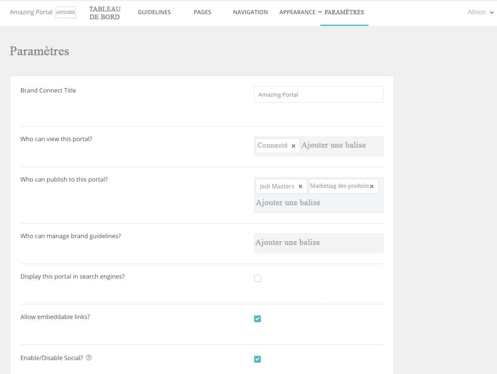

# Définir les paramètres système dans [!UICONTROL Brand Connect]

Les paramètres de [!UICONTROL Brand Connect] contrôlent qui peut voir le portail, qui peut publier du contenu sur le portail et qui peut gérer les directives de la marque.

Pour accéder aux paramètres, connectez-vous à [!UICONTROL Workfront DAM].

1. Cliquez sur l’**icône de configuration** dans la barre de navigation et sélectionnez **[!UICONTROL Brand Connect]**. Ou cliquez sur **[!UICONTROL Marques]** dans la barre de navigation.
1. Cliquez ensuite sur l’option **[!UICONTROL Modifier]** dans le coin supérieur droit du panneau [!UICONTROL Brand Connect]. Si votre organisation dispose de plusieurs instances [!UICONTROL Brand Connect], vérifiez que vous modifiez la bonne.

Adressez-vous à la personne chargée de vous conseiller concernant [!UICONTROL Workfront] si vous avez des questions sur l’un de ces paramètres.

* Titre **[!UICONTROL Brand Connect]** : nommez l’instance [!UICONTROL Brand Connect] (ou changer le nom).
* **Qui peut consulter ce portail ?**—Définissez les groupes qui peuvent consulter le [!UICONTROL Brand Connect]. Par exemple, si vous ajoutez le groupe [!UICONTROL Connectés], tous les utilisateurs et utilisatrices connectés peuvent afficher le portail. Cependant, même si une personne peut afficher le portail, elle ne pourra pas accéder aux ressources à moins que le groupe d’utilisateurs et d’utilisatrices [!UICONTROL Connectés] n’ait reçu des autorisations pour le dossier.
* **Qui peut publier sur ce portail ?**—Définissez les groupes qui peuvent publier des ressources sur le [!UICONTROL Brand Connect]. Il s’agira de groupes de contributeurs et de contributrices. Ils ne peuvent publier que les éléments auxquels ils ont accès.
* **Qui peut gérer les directives de marque ?**—Définissez les groupes qui peuvent gérer les directives de marque. La gestion des directives n’est pas limitée aux utilisateurs administrateurs et aux utilisatrices administratrices. Vous pouvez définir un groupe de contributeurs et de contributrices pour modifier les directives.
* **Afficher ce portail dans les moteurs de recherche ?**—Voulez-vous que l&#39;URL [!UICONTROL Brand Connect] s&#39;affiche lorsque les internautes effectuent des recherches sur Internet ?
* **Autoriser les liens incorporables ?**—Les liens incorporables peuvent-ils provenir de [!UICONTROL Brand Connect] ? Cela ajoute un panneau [!UICONTROL Obtenir des liens] au menu [!UICONTROL Partager] qui fournit des liens intégrables pour la ressource.
* **Activer/désactiver les réseaux sociaux ?** : si les réseaux sociaux sont activés (cochez la case), les utilisateurs peuvent aimer et commenter les ressources.
* **Activer/désactiver le téléchargement et le décompte des vues ?** : lorsqu’ils sont activés, les utilisateurs peuvent voir combien de fois une ressource a été téléchargée et combien de commentaires elle contient.
* **Masquer les facettes initialement** : masquez les filtres de recherche de métadonnées qui apparaissent dans le panneau de gauche de la page [!UICONTROL Ressources].
* **Libellé de lightbox** : sélectionnez un libellé pour [!UICONTROL Lightbox] - [!UICONTROL Lightbox], [!UICONTROL Collection], [!UICONTROL Favoris], ou [!UICONTROL Favoris].
