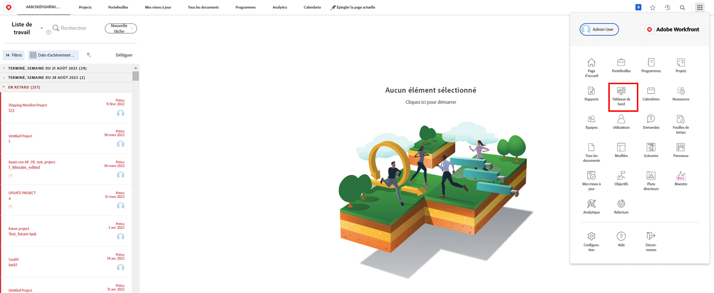
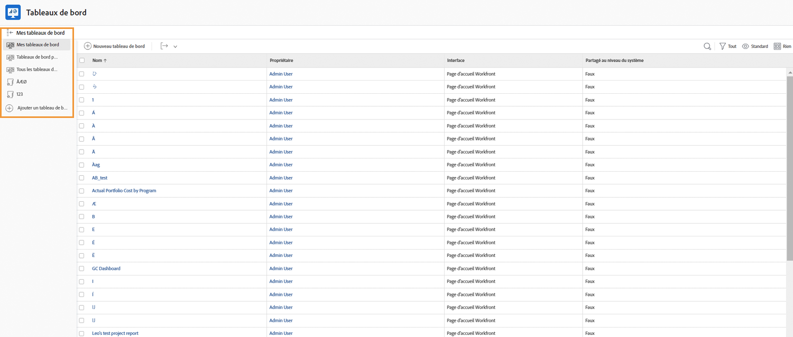
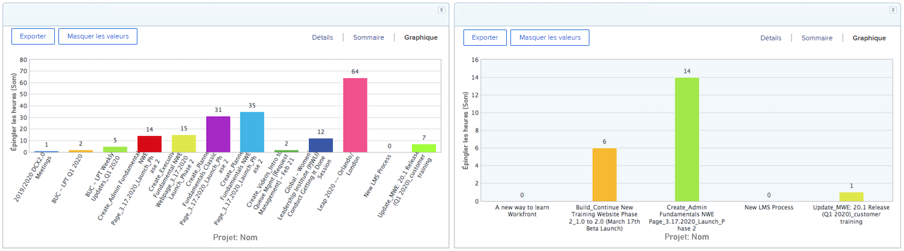
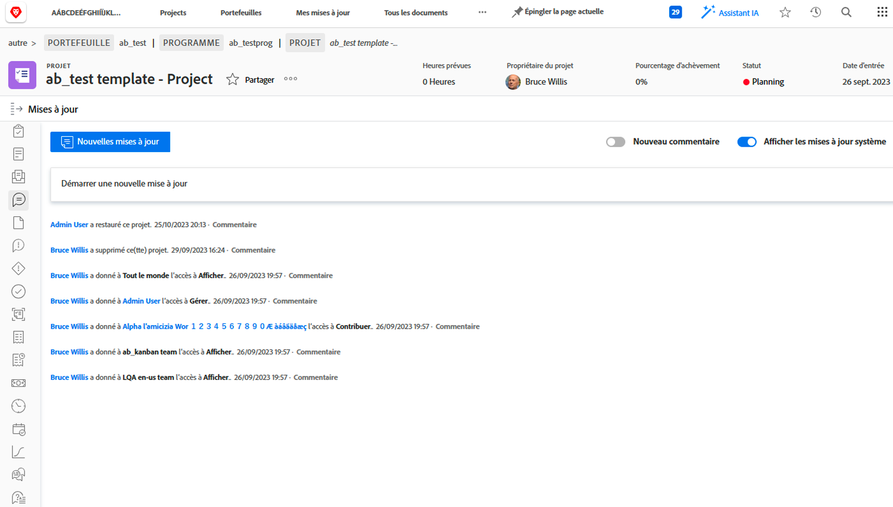
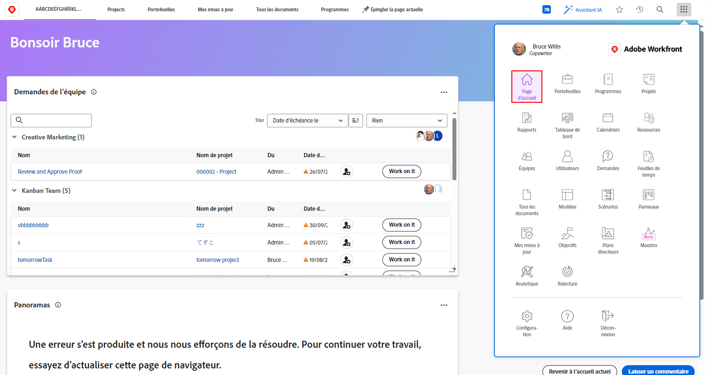

# Workfront pour les cadres

En tant qu’administrateur, Adobe Workfront peut :

* Tenez-vous informé de l’avancement du travail qui vous préoccupe tout au long de la procédure. **rapports et tableaux de bord**
* Donnez-vous un moyen facile de **communiquer avec les parties prenantes du projet à l’aide de mises à jour**
* Donnez-vous un moyen facile de **effectuer une requête de travail ;**
* Vous donner un moyen facile de voir **éléments en attente de votre approbation**

## Rapports et tableaux de bord

### Rapports

Les rapports dans Workfront sont la colonne vertébrale pour prendre de meilleures décisions, plus rapidement. Vous pouvez les voir partout où vous allez : dans la zone des projets, la zone des personnes ou sur une page d’entrée de tâche.

Les dirigeants et les dirigeants d’entreprise peuvent accéder à la zone de rapport pour afficher des rapports personnalisés contenant des informations spécifiques. Pour accroître la visibilité des rapports les plus importants, Workfront utilise des tableaux de bord.

### Tableaux de bord

En utilisant un tableau de bord, les dirigeants peuvent consulter et analyser rapidement toutes les parties du travail actuellement en cours dans leur organisation. Le tableau de bord est simplement une collection de rapports qui fournissent des informations que les dirigeants peuvent avoir à voir régulièrement. Les tableaux de bord sont entièrement personnalisables, de sorte que toute personne utilisant Workfront peut voir le travail qui lui importe.

Cliquez sur Tableaux de bord dans l’icône de menu principal dans le coin supérieur droit pour accéder à la zone Tableaux de bord .

Les dirigeants peuvent accéder aux différents tableaux de bord disponibles à partir de la navigation dans le panneau de gauche.

* **Tous les tableaux de bord**: affiche les tableaux de bord que vous ou d’autres utilisateurs avez créés et que vous êtes autorisé à au moins afficher.
* **Mes tableaux de bord**: affiche les tableaux de bord que vous avez créés.
* **Tableaux de bord partagés**: affiche les tableaux de bord créés par d’autres utilisateurs et partagés avec vous.

Grâce à un tableau de bord, les dirigeants peuvent consulter des éléments tels que &quot;Coûts, Recettes et Budgets&quot; pour les projets importants et les problèmes ouverts auxquels leurs équipes sont confrontées. Ils peuvent également afficher les projets à risque, ainsi qu’une liste des éléments qui doivent être approuvés par l’administrateur.

Les rapports dans Workfront peuvent contribuer à responsabiliser vos employés. Pour tirer parti des rapports, il est essentiel d’établir un processus clair pour la manière dont votre entreprise les utilise. Assurez-vous que tout le monde comprend clairement quels rapports sont utilisés pour mesurer le succès.

Exemple de rapports dans un tableau de bord dans Workfront

## Communication avec les parties prenantes du projet à l’aide de mises à jour

Communiquez avec l’équipe du projet au sein du projet lui-même afin que toutes les communications du projet soient facilement accessibles.

## Effectuer une requête

Dans de nombreuses entreprises, la première étape pour lancer un nouveau projet, développer un nouveau produit ou créer un livrable consiste à effectuer une demande dans Workfront. Vous pouvez suivre la progression de la requête et fournir des informations supplémentaires si nécessaire.

Dans cette vidéo, vous apprendrez à :

* Accédez à la zone de requête
* Effectuer une requête
* Affichage des requêtes envoyées

>[!VIDEO](https://video.tv.adobe.com/v/336092/?quality=12&learn=on)

## Éléments en attente d’approbation

Dans [!UICONTROL Accueil] vous pouvez facilement trouver les éléments en attente de votre approbation.

