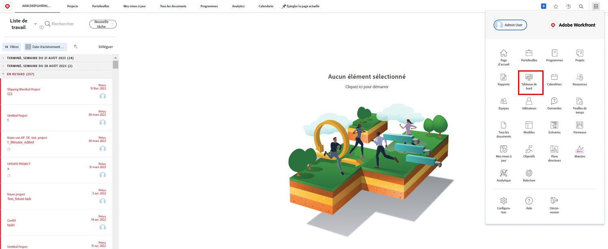
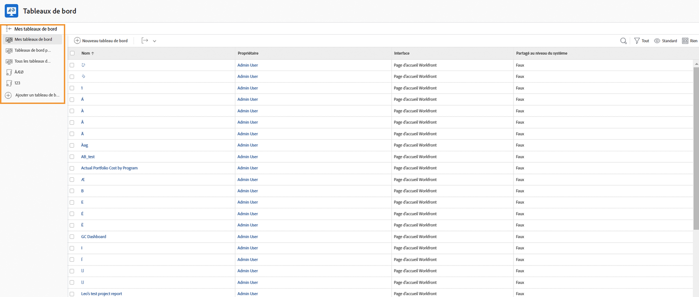
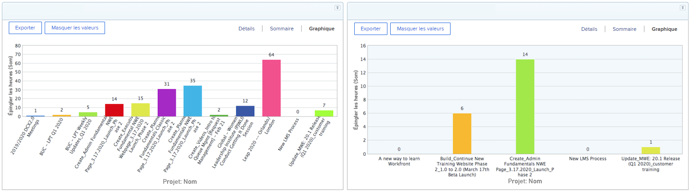
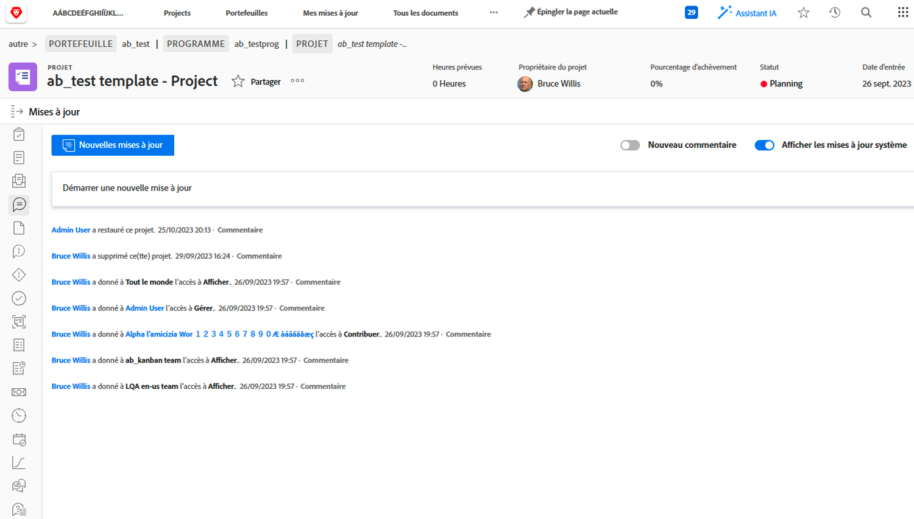
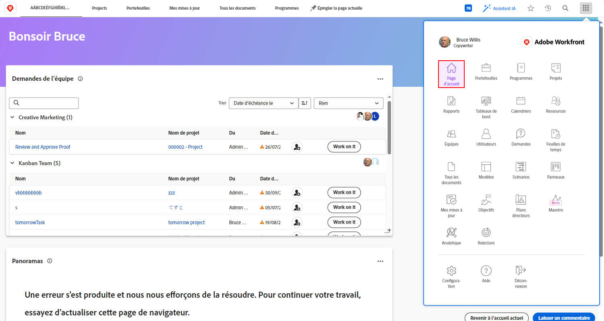

# Workfront pour les cadres

Découvrez comment Workfront peut vous aider à gérer le travail dans votre organisation.

En tant que cadre, Adobe Workfront peut :

* Vous maintenir au courant de l’avancement des travaux qui vous intéressent grâce à des **rapports et des tableaux de bord**
* Vous offir un moyen simple de **communiquer avec les parties prenantes du projet à l’aide de mises à jour**
* Vous donner un moyen facile de **faire une demande de travail**
* Vous permettre de consulter facilement **les éléments en attente de votre approbation**

## Rapports et tableaux de bord

### Rapports

Les rapports dans Workfront sont l’épine dorsale qui permet de prendre de meilleures décisions, plus rapidement. Vous pouvez les voir partout : dans la zone des projets, la zone des personnes ou sur une page de destination de tâche.

La direction et les cadres peuvent naviguer dans la zone des rapports pour consulter des rapports personnalisés contenant des informations spécifiques. Pour accroître la visibilité des rapports les plus importants, Workfront utilise des tableaux de bord.

### Tableaux de bord

En utilisant un tableau de bord, les dirigeants peuvent afficher et analyser rapidement en profondeur toute partie du travail en cours dans leur entreprise.Le tableau de bord est simplement un ensemble de rapports qui fournit des informations que les dirigeants peuvent avoir besoin de consulter régulièrement. Les tableaux de bord sont entièrement personnalisables, de sorte que toute personne utilisant Workfront peut voir le travail qui lui importe.

Cliquez sur Tableaux de bord dans l’icône de menu principal dans le coin supérieur droit pour accéder à la zone Tableaux de bord.

La direction peut accéder aux différents tableaux de bord disponibles à partir de la navigation dans le panneau de gauche.

* **Tous les tableaux de bord** : affiche les tableaux de bord que vous ou d’autres personnes avez créés et que vous avez au moins le droit de consulter.
* **Mes tableaux de bord** : affiche les tableaux de bord que vous avez créés.
* **Tableaux de bord partagés** : affiche les tableaux de bord créés par d’autres personnes et partagés avec vous.

Avec un tableau de bord, la direction peut examiner des éléments tels que les « coûts, revenus et budgets » pour les projets importants et les problèmes en suspens traitées par ses équipes. Elle peut également afficher les projets à risque, ainsi qu’une liste des éléments qui doivent être approuvés par une personne cadre.

Les rapports de Workfront peuvent aider à responsabiliser vos collaborateurs et collaboratrices. La clé de l’exploitation des rapports est d’établir un processus clair pour leur utilisation par votre organisation. Assurez-vous que tout le monde comprend clairement quels rapports sont utilisés pour mesurer le succès.

Exemple de rapports dans un tableau de bord de Workfront

## Communiquer avec les parties prenantes du projet en utilisant les mises à jour

Communiquez avec l’équipe de projet dans le cadre du projet lui-même afin que toutes les communications relatives au projet soient facilement accessibles.

## Effectuer une demande

Dans de nombreuses organisations, la première étape du lancement d’un nouveau projet, du développement d’un nouveau produit ou de la création d’un produit livrable consiste à effectuer une demande dans Workfront. Vous pouvez suivre la progression de la demande et fournir des informations supplémentaires si nécessaire.

Dans cette vidéo, vous apprendrez à :

* Accéder à la zone de demande
* Effectuer une demande
* Afficher les demandes envoyées

>[!VIDEO](https://video.tv.adobe.com/v/336092/?quality=12&learn=on&enablevpops=1)

## Éléments en attente d’approbation

Dans la page d’[!UICONTROL Accueil], vous pouvez facilement trouver des éléments en attente de votre approbation.

