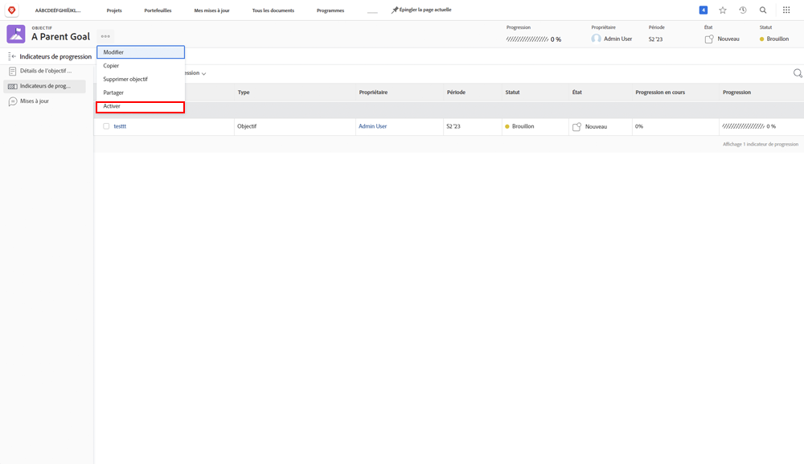

# Activer en alignant un objectif sur un autre

Lorsque vous alignez deux objectifs, l’un devient l’objectif parent et l’autre l’objectif enfant. Un objectif parent peut avoir plusieurs objectifs enfants, mais un objectif enfant ne peut s’aligner que sur un seul objectif parent.

1. Ouvrez l’objectif enfant en cliquant sur son nom dans la [!UICONTROL Liste des objectifs]. Par défaut, vous accédez à l’onglet [!UICONTROL Détails de l’objectif].
1. Cliquez sur le bouton [!UICONTROL +Ajouter] dans le panneau [!UICONTROL Informations sur l’objectif parent].

   ![Capture d’écran de l’onglet [!UICONTROL Détails de l’objectif]](assets/06-workfront-goals-align-goals.png)

1. Commencez à taper le nom de l’objectif parent souhaité dans le champ [!UICONTROL Objectif parent], puis sélectionnez-le lorsqu’il apparaît dans la liste. Seuls les objectifs de la même période ou d’une période ultérieure apparaissent dans la liste.

   ![Capture d’écran du panneau [!UICONTROL Détails de l’objectif] affichant le panneau [!UICONTROL Informations sur l’objectif parent]](assets/07-workfront-goals-align-to.png)

1. Cliquez sur [!UICONTROL Enregistrer les modifications].

L’alignement d’un objectif sur un autre crée un objectif enfant. Les objectifs enfants sont des objectifs individuels qui contribuent à la progression des objectifs parents de l’organisation ou de l’équipe. Les objectifs enfants peuvent activer et influencer la progression de l’objectif parent.

## Activez maintenant l’objectif parent.

Une fois l’objectif enfant créé, ce dernier devient un indicateur de progression de votre objectif parent. L’option Activer s’affiche lorsque vous cliquez sur le menu à trois points en regard du nom de l’objectif parent.

