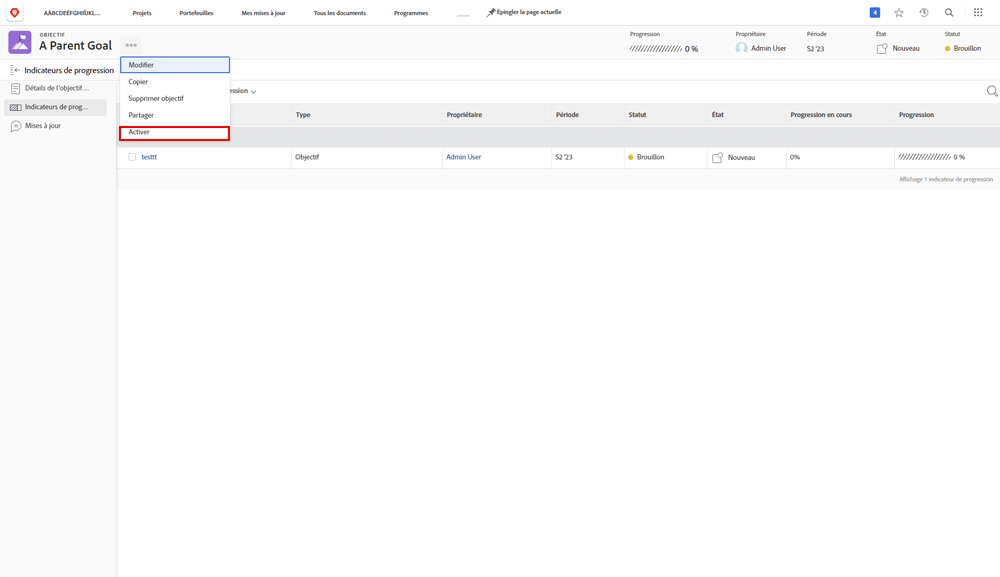

# Activer en alignant un objectif sur un autre

Lorsque vous harmonisez deux objectifs, l’un devient l’objectif parent et l’autre un objectif enfant. Un objectif parent peut avoir plusieurs objectifs enfants, mais un objectif enfant ne peut s’aligner que sur un seul objectif parent.

1. Ouvrez l’objectif enfant en cliquant sur son nom dans le [!UICONTROL Liste des objectifs]. Par défaut, vous trouverez dans la variable [!UICONTROL Détails de l’objectif] .
1. Cliquez sur le bouton [!UICONTROL +Ajouter] dans le [!UICONTROL Informations sur l’objectif parent] du panneau.

   ![Capture d’écran de la [!UICONTROL Détails de l’objectif] tab](assets/06-workfront-goals-align-goals.png)

1. Commencez à saisir le nom de l’objectif parent souhaité dans le champ [!UICONTROL Objectif parent] puis sélectionnez-la lorsqu’elle apparaît dans la liste. Seuls les objectifs de la même période ou d’une période ultérieure apparaissent dans la liste.

   ![Capture d’écran de la [!UICONTROL Détails de l’objectif] affichant le panneau [!UICONTROL Informations sur l’objectif parent] panel](assets/07-workfront-goals-align-to.png)

1. Cliquez sur [!UICONTROL Enregistrer les modifications].

L’alignement d’un objectif sur un autre objectif crée un objectif enfant. Considérez les objectifs enfants comme des objectifs individuels qui contribuent à la progression des objectifs parents de l’organisation ou de l’équipe. Les objectifs enfants peuvent activer et influencer la progression de l’objectif parent.

## Activation de l’objectif parent

Maintenant que vous avez créé un objectif enfant, il devient un indicateur de progression sur votre objectif parent. L’option Activer s’affiche lorsque vous cliquez sur le menu à trois points en regard du nom de l’objectif parent.

