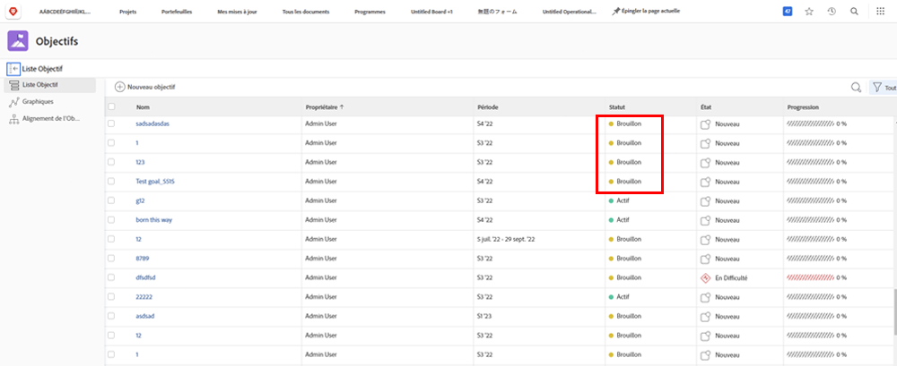
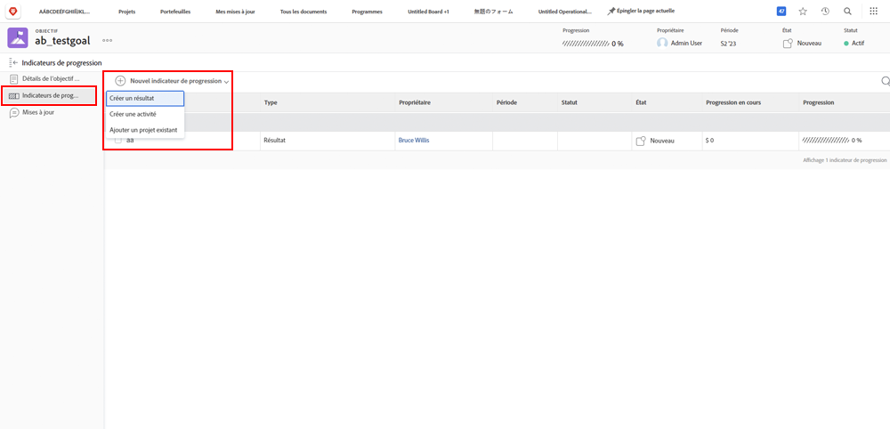
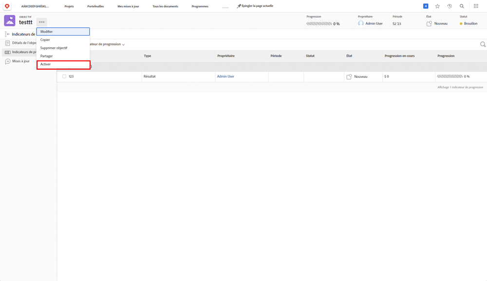

# Activation des objectifs dans [!DNL Workfront]

Maintenant que vous avez créé des objectifs, activons-les ! Lorsque vous créez un objectif, il est enregistré dans [!UICONTROL Version préliminaire] statut. [!UICONTROL Version préliminaire] les objectifs ne font pas partie de la gestion des objectifs tant que vous ne les avez pas activés. Une fois activés, ils passent à une [!UICONTROL Principal] et afficher la progression dans le tableau de bord et la manière dont ils s’alignent sur la stratégie globale. Objectifs dans [!UICONTROL Principal] Les statuts sont associés à un indicateur de progression (généralement une activité, un résultat, un projet ou un objectif aligné (relation d’objectif enfant-parent).

## Des indicateurs de progression sont nécessaires pour activer les objectifs

Avant de poursuivre, il est important de comprendre les indicateurs de progression utilisés dans [!DNL Workfront Goals]. Les indicateurs de progression sont les objets de la variable [!DNL Goals] utilisé pour calculer la progression d’un objectif. Les indicateurs de progression sont les objectifs, les résultats, les activités et les projets harmonisés. Vous en apprendrez plus en détail plus tard. Pour l’instant, il est important de comprendre que des objectifs, des résultats, des activités et des projets alignés doivent être ajoutés à un objectif afin de l’activer.

Pour ajouter un indicateur de progression, ouvrez l&#39;objectif et sélectionnez l&#39;onglet Indicateurs de progression à gauche, puis le menu déroulant Nouvel indicateur de progression situé à côté.

Par rapport à d’autres indicateurs de progression, les projets sont un peu uniques, car ils sont considérés comme un type d’activité. Les activités peuvent être différenciées en deux types : la barre de progression manuelle et les projets. Par conséquent, les projets stimulent également la progression. Bien que tous les types d’indicateurs de progression puissent être liés à un objectif parent, il est important de garder à l’esprit qu’il existe des différences dans la manière dont vous les gérez.

## Activez maintenant l’objectif.

Lorsque votre objectif comporte au moins un indicateur de progression, l’option Activer s’affiche lorsque vous cliquez sur le menu à trois points en regard du nom de l’objectif.

