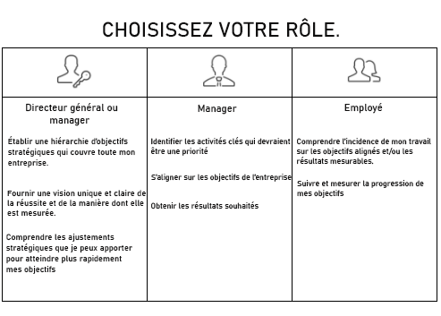

# Configurer les [!UICONTROL objectifs de Workfront] pour votre organisation

*Cette section est destinée aux administrateurs et administratrices système de [!DNL Workfront] chargés de configurer les objectifs de Workfront pour leurs utilisateurs et utilisatrices.*

Pour que votre organisation progresse rapidement, vous devez vous assurer que l’exécution du travail est alignée sur la stratégie de l’entreprise. [!DNL   Goals] coordonne la stratégie, les objectifs et les activités visant à stimuler l’exécution à l’échelle de l’organisation et à obtenir des résultats opérationnels mesurables.

Les bonnes pratiques en matière d’objectifs commencent par les objectifs de l’entreprise au plus haut niveau, puis se répercutent au niveau du groupe, de l’équipe et de l’individu. Les objectifs qui en découlent doivent être alignés sur les priorités de l’entreprise, y contribuer et les soutenir. Dans [!DNL Workfront], les objectifs sont étayés par les résultats ou les activités qui indiquent comment les atteindre.

## Liste de contrôle [!DNL Workfront Goals]

Les conditions suivantes doivent être remplies pour pouvoir accéder à [!DNL   Goals] :

* Votre organisation doit acquérir une licence [!DNL Workfront Goals], en plus de la licence [!DNL Workfront].
* Votre organisation doit utiliser la nouvelle interface d’expérience [!DNL Workfront]. [!DNL Workfront Goals] n’est pas disponible dans l’interface [!DNL Workfront] classique.
* Vos utilisateurs et utilisatrices [!DNL Workfront Goals] doivent avoir accès aux [!DNL Workfront Goals] à leur niveau d’accès.
* Vous devez affecter un modèle de disposition qui comprend la zone [!DNL Workfront Goals] dans le menu principal pour permettre aux utilisateurs et utilisatrices d’accéder à la fonctionnalité.

## Qui peut utiliser [!DNL Workfront Goals]

Bien que les contributeurs et contributrices individuels aient souvent des objectifs personnels, nous recommandons d’utiliser [!DNL Workfront Goals] pour soutenir le travail de votre organisation dans la réalisation de ses objectifs stratégiques. Tous les membres de l’organisation doivent être incités à définir des objectifs alignés sur la stratégie globale de l’entreprise et liés à leurs activités quotidiennes.

Lisez les descriptions de rôle ci-dessous et déterminez votre rôle dans [!DNL Workfront Goals].

Les cadres supérieurs et les responsables peuvent utiliser [!DNL Workfront Goals] pour :

* Établir une hiérarchie des objectifs stratégiques qui se répercutent sur l’ensemble de l’entreprise.
* Fournir une vision unifiée et claire de ce à quoi ressemble le succès et de la façon dont il est mesuré.
* Découvrir les ajustements stratégiques qui peuvent être effectués pour accélérer la progression des objectifs.

Les contributeurs et contributrices individuels peuvent utiliser [!DNL Workfront Goals] pour :

* Aligner leurs objectifs sur les initiatives stratégiques globales de l’entreprise.
* Mesurer leur progression et les réalisations par rapport aux objectifs stratégiques.
* Ajuster leurs objectifs personnels selon les besoins pour rester en phase avec l’orientation de l’entreprise.

