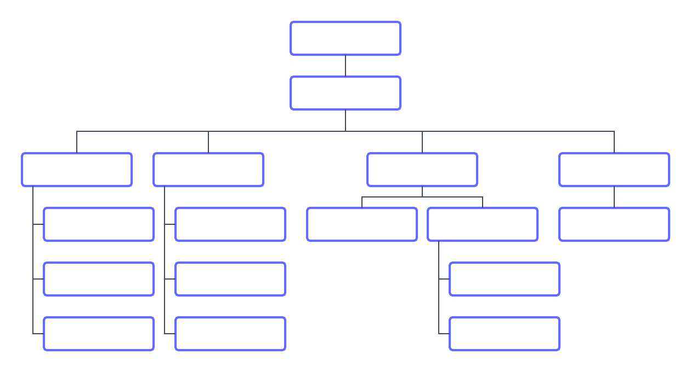

# Comprendre le fonctionnement de [!DNL Workfront Goals]

Dans cette vidéo, vous découvrirez :

* À formuler le « quoi » et le « pourquoi » pendant la phase de planification.
* Des exemples d’objectifs
* Le champ d’influence

>[!VIDEO](https://video.tv.adobe.com/v/3413132/?captions=fre_fr&quality=12&learn=on&enablevpops=1)

## Désigner des personnes responsables

Avant de commencer à configurer [!DNL Workfront Goals], vous devez identifier les personnes de votre organisation qui seront responsables de la réalisation de chaque objectif.

Il y a plusieurs façons de procéder. [!DNL Workfront] recommande de dessiner votre organigramme. Il y aura probablement plusieurs niveaux de propriétaires d’objectifs. Commencez par la direction au plus haut niveau, puis identifiez les équipes et les membres de l’équipe responsables de l’exécution du travail nécessaire pour obtenir les résultats souhaités. Il est nécessaire de savoir quels sont les objectifs à poursuivre afin d’optimiser la productivité.

Ensuite, prenez du recul et observez vos collaborateurs et collaboratrices. Déterminez qui a besoin d’un accès complet à la gestion/modification, d’un accès en lecture seule uniquement ou d’aucun accès. Le nombre de personnes sans accès devrait être relativement faible, car la plupart d’entre elles auront au moins besoin de voir les objectifs dans un contexte stratégique.

>[!NOTE]
>
>Lorsque vous identifiez les principaux responsables de l’objectif, tenez compte du fait que vous fixez des objectifs stratégiques pour les résultats de l’entreprise, et non des objectifs de développement personnel. Workfront vous recommande d’ajouter uniquement des objectifs de développement qui contribuent directement aux objectifs de l’entreprise ou qui les stimulent.

Nous vous montrerons comment mettre en place et configurer vos paramètres dans [!DNL Workfront Goals], Partie 2 : créez et gérez vos objectifs.

<!--
URL for part 2 reference above
-->
