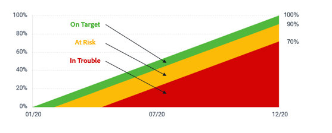

# Calculer la progression de l’objectif

[!DNL Workfront Goals] calcule la progression de l’objectif et affiche les informations suivantes :

* **Pourcentage réel terminé** : pourcentage de réalisation de l’objectif à ce jour. Cette valeur correspond à la moyenne du pourcentage terminé de tous les indicateurs de progression associés à l’objectif.
* **Pourcentage prévu terminé** : pourcentage de l’objectif qui doit être terminé, à ce stade, pour que l’objectif soit atteint dans les temps. Cette valeur est calculée en fonction de la durée de l’objectif (nombre total de jours) et de l’instant actuel (nombre total de jours écoulés depuis la date de début de l’objectif).
* **Progression** : libellé qui indique si l’objectif est dans les temps, ou s’il existe un risque qu’il ne soit pas terminé.

![Copie d’écran de la progression de l’objectif dans [!DNL Workfront Goals]](assets/13-workfront-goals-percent-complete.png)

Le graphique suivant illustre la relation entre les libellés de progression de l’objectif et le pourcentage de progression :

La progression de votre objectif est un bon moyen de vous faire une idée de son état d’avancement en fonction des mises à jour que vous introduisez dans le système. C’est pourquoi il est si important de mettre à jour vos activités et vos résultats dans les objectifs. Les libellés de progression permettent de communiquer un statut normalisé au reste de l’organisation.

![Graphique couvrant les différents libellés de progression dans [!DNL Workfront Goals]](assets/15-workfront-goals-progress-bar-code.png)

>[!TIP]
>
>Pour plus d’informations sur les formules utilisées pour calculer la progression de l’objectif, consultez cet article : [Présentation de la progression et de la condition des objectifs dans Adobe Workfront Goals](https://experienceleague.adobe.com/docs/workfront/using/adobe-workfront-goals/goal-management/calculate-goal-progress.html?lang=en#overview-of-goal-progress-and-threshold?lang=fr).

