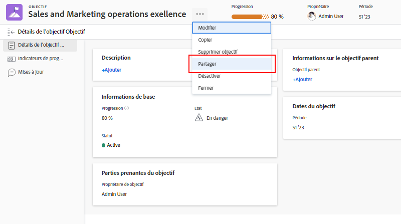

# Communiquer le statut des objectifs

Maintenant que vous avez mis à jour vos objectifs, prenez un peu de recul pour avoir une vue d’ensemble des objectifs sur lesquels vous travaillez et de leur relation avec les objectifs de l’équipe, du groupe et de l’entreprise. Communiquer avec d’autres personnes sur la progression et le statut de vos objectifs est important pour rester aligné.

Il existe plusieurs façons de tenir les bonnes personnes informées de vos objectifs. Vous pouvez commencer par :

* Partager et rendre compte de vos objectifs
* La section [!UICONTROL Graphiques] vous permet d’obtenir un aperçu complet de la progression de vos objectifs.

## Partager un objectif

Vous pouvez partager un objectif que vous avez créé ou un objectif créé par une autre personne et que vous avez le droit de gérer. Vous ne pouvez pas partager des objectifs avec des groupes, des équipes ou des entreprises. Si vous avez les autorisations de gérer un objectif, vous pouvez modifier les autorisations de l’objectif pour la personne qui crée l’objectif. Par défaut, la personne qui crée l’objectif dispose des autorisations de gestion, mais vous pouvez les modifier en autorisations d’affichage.

1. Cliquez sur le nom de l’objectif à partager dans n’importe quelle section de la zone [!DNL Goals] pour ouvrir le panneau [!UICONTROL Détails de l’objectif].

1. Cliquez sur l’icône à 3 points de suspension située à côté du nom de l’objectif, puis cliquez sur [!UICONTROL **Partager**]. La zone [!UICONTROL Accès à l’objectif] s’affiche.

   

1. Utilisez l’une des méthodes suivantes :

   * Sélectionnez le paramètre [!UICONTROL Gestion à l’échelle du système] pour donner des autorisations de gestion à toutes les personnes du système qui ont accès à [!DNL Goals] par le biais de leur niveau d’accès [!DNL Workfront]. Cette option est désélectionnée par défaut pour tous les nouveaux objectifs.
   * Commencez à taper le nom d’une personne à qui vous voulez donner les autorisations [!UICONTROL Gestion] dans la zone [!UICONTROL Autoriser l’accès à la gestion à]. Sélectionnez le nom qui apparaîtra dans la liste.

1. Cliquez sur [!UICONTROL **Partager**]. Un libellé « À l’échelle du système » ou les noms des personnes qui ont des autorisations de gestion pour l’objectif s’affichent dans le champ [!UICONTROL Accès à la gestion] dans le panneau [!UICONTROL Détails de l’objectif].

## Rapport sur les informations d’objectif

Vous pouvez créer des rapports sur les objectifs ou des rapports sur les projets qui contiennent des informations sur les objectifs associés dans [!DNL Workfront]. Il existe plusieurs façons d’afficher les informations d’objectif dans les rapports.

* Créez un rapport sur l’objectif dans la zone Rapports. Vous pouvez afficher diverses informations sur l’objectif dans le rapport Objectif (par exemple : le nom, la personne propriétaire, les dates, la progression, etc.), y compris les éléments suivants :

   * **Hiérarchie d’objectifs** : affiche tous les objectifs parents et la manière dont ils sont reliés les uns aux autres.
   * **Est l’objectif de la société** : indique si votre organisation est désignée comme propriétaire d’un objectif.
   * **Type de personne propriétaire** : indique si la personne propriétaire d’un objectif est un utilisateur ou une utilisatrice, une équipe ou un groupe.

* Créez un rapport de projet qui affiche des informations sur les objectifs, notamment les éléments suivants :
   * **Hiérarchie d’objectifs** : affiche tous les objectifs parents et la manière dont ils sont reliés les uns aux autres.
   * **Objectifs** : il s’agit d’un champ de collecte qui affiche tous les objectifs associés à un projet.
   * **Nombre d’objectifs liés** : nombre d’objectifs associés au projet.
