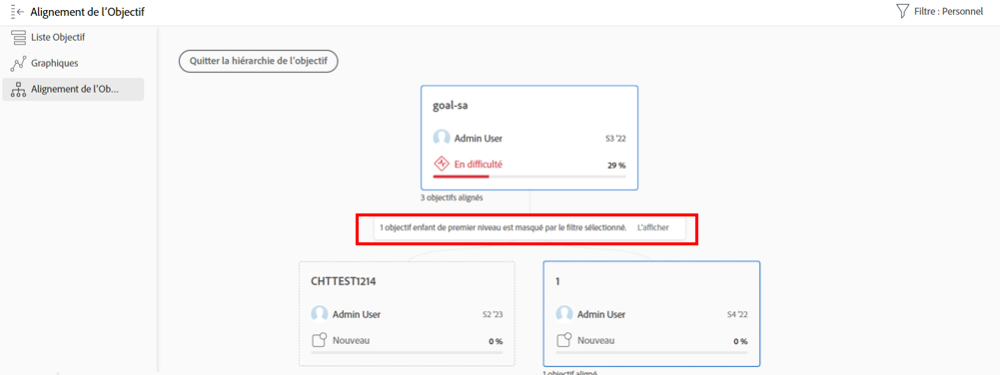

# Affichage des mises à jour individuelles de l’objectif

Dans cette vidéo, vous apprendrez à :

* Affichez vos objectifs individuels dans le [!UICONTROL Pulse] flux de mise à jour

>[!VIDEO](https://video.tv.adobe.com/v/335200/?quality=12&learn=on)

## Filtrage des informations dans votre flux de pulsation

Vous remarquerez peut-être que parfois vous obtenez trop d’informations dans la variable [!UICONTROL Pulse] ou peut-être pas les bonnes informations. Filtrez les informations de votre flux pour voir exactement ce que vous souhaitez ou ce dont vous avez besoin.

1. Cliquez sur [!UICONTROL **Pulse**] dans le panneau de gauche.
1. Cliquez sur le bouton [!UICONTROL **Filtrer**] dans le coin supérieur droit.
1. Sélectionnez une option de filtrage. Le filtre Toutes est appliqué par défaut et affiche tous les objectifs de votre système. Vous pouvez effectuer l’une des opérations suivantes :

   * Sélectionnez l’un des filtres prédéfinis répertoriés sous le [!UICONTROL Enregistré] du panneau filtres pour afficher les objectifs pour les propriétaires (c.-à-d. [!UICONTROL Tous], [!UICONTROL Personal], [!UICONTROL Mes équipes], [!UICONTROL Mes groupes], et [!UICONTROL Société]).
   * Passez la souris sur le nom d’un filtre, puis cliquez sur l’icône **Modifier** en regard de son nom pour le personnaliser et ajouter des noms spécifiques d’utilisateurs, d’équipes, de groupes ou du nom de votre organisation.
   * Cliquez sur [!UICONTROL **Nouveau filtre**] pour créer un nouveau filtre, puis effectuez une sélection dans la liste des options de personnalisation et de filtrage par [!UICONTROL Période], [!UICONTROL État], [!UICONTROL Progression], et/ou [!UICONTROL Propriétaire].

   ![Une image de la fonction [!UICONTROL Filtres] dans [!DNL Workfront Goals]](assets/18-workfront-goals-pulse-stream.png)

**Remarque :** Votre sélection de filtrage est conservée et les informations contenues dans les autres sections de [!DNL Goals] s’affiche en fonction de ces informations. Vous pouvez localiser et filtrer les objectifs dans différentes sections de la fonction [!DNL Goals] area dans [!DNL Workfront]:

* [!UICONTROL Liste d’objectifs]
* [!UICONTROL Graphiques]
* [!UICONTROL Pulsation]
* [!UICONTROL Alignement des objectifs]. Dans cette section, vous pouvez afficher temporairement les objectifs qui ne correspondent pas au filtre appliqué afin d’obtenir une vue d’ensemble de tous les objectifs alignés. Cliquez sur le bouton [!UICONTROL **Afficher/Afficher**] s’il existe des objectifs masqués par le filtre sélectionné.

   
