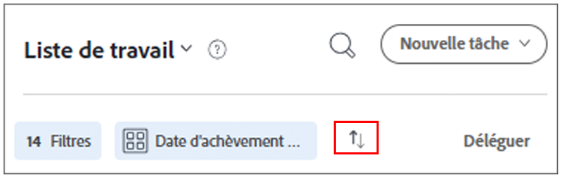

# Organisez votre liste de tâches dans [!DNL Workfront] [!UICONTROL Accueil]

>[!NOTE]
>
>Le [!UICONTROL [!DNL Sort by]] dans le [!UICONTROL Liste de tâches] a été renommé en [!UICONTROL Group by], et les tâches et les problèmes peuvent également être regroupés selon leur [!UICONTROL Date de début planifiée].

Dans cette vidéo, vous apprendrez à :

* Trier les affectations de travail
* Filtrage des affectations de travail par type
* Identifier le travail prêt à commencer
* Accepter les affectations de travail

>[!VIDEO](https://video.tv.adobe.com/v/335099/?quality=12)

>[!NOTE]
>
>Par défaut, les premiers éléments d’échéance apparaissent en haut de la page [!UICONTROL Liste de tâches]. Si vous souhaitez que vos tâches apparaissent dans l’ordre décroissant, cliquez sur les flèches situées à droite de la zone Group by .

