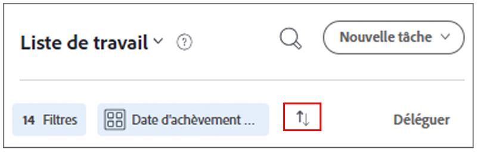

# Organisez votre liste de tâches sur la page d’[!UICONTROL accueil] [!DNL Workfront].

>[!NOTE]
>
>L’option [!UICONTROL [!DNL Sort by]] de la [!UICONTROL Liste de travail] a été renommée en [!UICONTROL Regrouper par]. Les tâches et les problèmes peuvent également être regroupés selon leur [!UICONTROL Date de début prévue].

Dans cette vidéo, vous apprendrez à :

* Trier les affectations de travail
* Filtrer les affectations de travail par type
* Identifier le travail prêt à démarrer
* Accepter les affectations de travail

>[!VIDEO](https://video.tv.adobe.com/v/335099/?quality=12&learn=on&enablevpops=1)

>[!NOTE]
>
>Par défaut, les éléments dont l’échéance est la plus proche s’affichent en haut de la [!UICONTROL liste de travail]. Si vous souhaitez que vos éléments s’affichent dans l’ordre décroissant, cliquez sur les flèches situées à droite de la zone Regrouper par.

