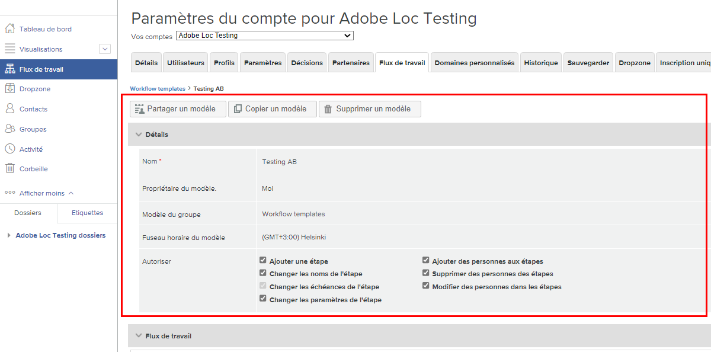

# Modification d’un modèle de workflow automatisé

À mesure que les processus d’examen et d’approbation des BAT sont affinés ou que des changements organisationnels sont apportés, les modèles de workflow automatisés doivent être mis à jour pour refléter les opérations en cours de vos équipes utilisant Workfront.

Garder les modèles à jour garantit la cohérence de vos processus de révision et d’approbation, et permet de gagner du temps aux personnes qui chargent des BAT, car elles n’ont pas à ajuster constamment un workflow.

1. Sélectionner **[!UICONTROL Vérification]** de la **[!UICONTROL Menu Principal]** in [!DNL Workfront].
1. À partir de là, sélectionnez **[!UICONTROL Workflows]** dans le menu du panneau de gauche.
1. Cliquez sur le menu à 3 points à l’extrémité droite du nom du modèle et sélectionnez **[!UICONTROL Afficher les détails du modèle]**.

Les options de partage, de copie et de suppression du modèle s’affichent en haut de la fenêtre des détails du modèle pour chaque modèle. La suppression d&#39;un modèle n&#39;affecte pas les BAT en cours auxquels ce modèle est appliqué, mais cela signifie que le modèle n&#39;est plus disponible.

<!--
Lean More URLs
-->

Cliquez sur la flèche pour développer la [!UICONTROL Détails] pour modifier des éléments tels que le nom du modèle ou le fuseau horaire du modèle.

## Apporter des modifications aux étapes et aux destinataires

Des modifications peuvent être nécessaires dans la variable [!UICONTROL Workflow] zone où un processus simplifié signifie une date limite antérieure ou lorsqu’une personne rejoint l’équipe et passe en revue les bons à tirer.

Chaque étape d’un workflow automatisé comporte sa propre section, qui permet de modifier indépendamment les échéances, la confidentialité, les destinataires du BAT et d’autres informations.

Cette vidéo présente brièvement quelques-uns des changements que vous pouvez effectuer dans le [!UICONTROL Workflow] zone. Reportez-vous à la liste à puces sous cette vidéo, qui examine ces paramètres. Il n&#39;y a pas d&#39;audio sur cette vidéo.

>[!VIDEO](https://video.tv.adobe.com/v/335131/?quality=12&learn=on)

Voici les modifications que vous pouvez apporter au modèle de BAT dans la section [!UICONTROL Workflow] section :

* Cliquez dans le [!UICONTROL nom de l’étape] ou le champ [!UICONTROL échéance] pour mettre à jour ces informations.
* Sélectionnez la flèche en regard du [!UICONTROL échéance] pour verrouiller l’étape, déterminez le moment où l’étape est activée ou ne nécessite qu’une seule décision.
* Dans la liste des destinataires, cliquez sur le bouton [!UICONTROL Rôle] ou [!UICONTROL Alertes par email] pour sélectionner une autre option.
* Accédez au menu à 3 points situé à l’extrémité droite du nom d’un destinataire pour le supprimer de la liste, en faire le décideur Principal de l’étape de ce workflow ou modifiez le rôle du BAT et les informations d’alerte par courrier électronique.
* Vous avez deux options pour ajouter des destinataires à la liste. Une fois que vous avez ouvert la [!UICONTROL Ajout de personnes à la scène] cliquez sur l’étape à laquelle les ajouter. Saisissez ensuite leur nom ou adresse email dans la liste des destinataires et attribuez un rôle de BAT et une alerte par email. Cliquez sur le bouton [!UICONTROL Ajouter des personnes] lorsque vous avez terminé.
   1. Dans le coin supérieur droit de chaque section d’étape, accédez au [!UICONTROL Plus] et sélectionnez [!UICONTROL Ajout de personnes à la scène].
   1. En haut de la [!UICONTROL Workflow] zone, sélectionnez [!UICONTROL Ajout de personnes à la scène].

## Partage de modèles

Le [!UICONTROL Partagé avec] affiche les utilisateurs du BAT qui peuvent utiliser le modèle. Supprimez les personnes qui n’ont plus besoin d’utiliser le modèle en cliquant sur le menu à 3 points situé à l’extrémité droite de leur nom et en sélectionnant [!UICONTROL Supprimer].

![[!UICONTROL Partagé avec] list](assets/proof-system-setups-edit-template-shared-with.png)

Cependant, vous ne pouvez pas ajouter de personnes à la liste de partage à partir de cette section. Pour ce faire, revenez dans la partie supérieure de la fenêtre des détails du modèle et cliquez sur le bouton [!UICONTROL Partager le modèle] bouton .

## Section de l’activité

[!DNL Workfront] conserve un historique d’audit du moment où des modifications ont été apportées au modèle. Vous pouvez voir la date, qui a apporté la modification, et quelques informations brèves sur les modifications apportées.

Cette section n’enregistre pas les informations sur le moment où le modèle a été utilisé sur les bons à tirer.

