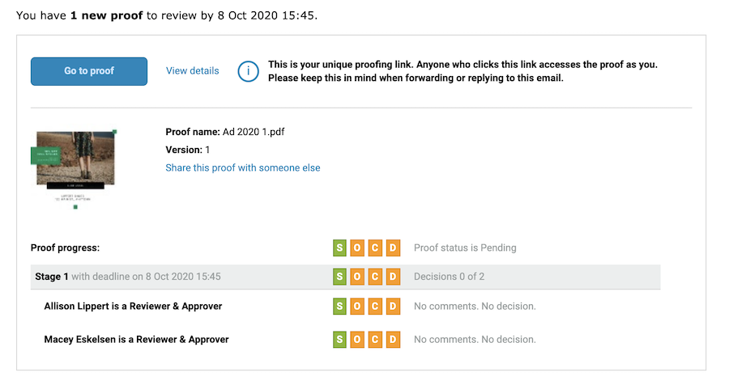

# Présentation des alertes par email et des notifications de BAT

Les alertes par email diffèrent des emails de notification de BAT. Vous recevrez un e-mail de notification de BAT lorsque vous aurez reçu un nouveau BAT à vérifier, lorsqu’un BAT est en retard ou lorsqu’une nouvelle version du BAT vous sera affectée.

Si vous désactivez l’option de notification lors du téléchargement d’un BAT, personne ne reçoit de communication de [!DNL Workfront] au sujet d&#39;une nouvelle preuve à examiner.

Les alertes par email sont définies par validant/approbateur, le plus souvent lors du téléchargement du BAT. Un type d’alerte par défaut peut être attribué aux destinataires de vos BAT afin que vous n’ayez pas à le définir chaque fois que vous chargez un BAT. Contactez votre administrateur système pour connaître les paramètres par défaut à définir.

Même si les alertes par e-mail sont définies sur [!UICONTROL Désactivé], les destinataires du BAT sont toujours informés d’un nouveau BAT ou d’une nouvelle version.

## Bonnes pratiques

| Bonne pratique | Voici pourquoi : |
|---|---|
| Désactivez le paramètre &quot;Envoyer des emails à partir de Workfront lorsqu’un commentaire est fait sur un BAT&quot; dans les configurations Workfront | Lorsque ce paramètre est activé (par défaut), les utilisateurs peuvent recevoir plusieurs notifications par e-mail pour chaque commentaire sur un BAT, l’une provenant de la fonctionnalité de vérification et l’autre de Workfront. Ces notifications en double provoquent des perturbations et une confusion dans les notifications par e-mail, ainsi qu’une boîte de réception par e-mail complète, ce qui peut entraîner l’ignorance des notifications de BAT reçues par les utilisateurs. Ce qui, à son tour, pourrait signifier des échéances non respectées.    Remarque : ce paramètre est disponible dans le menu principal de Workfront > Configuration > Email > Révision et approbation. |

