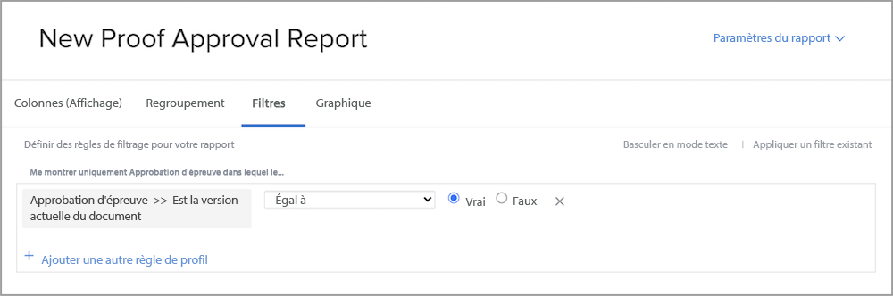
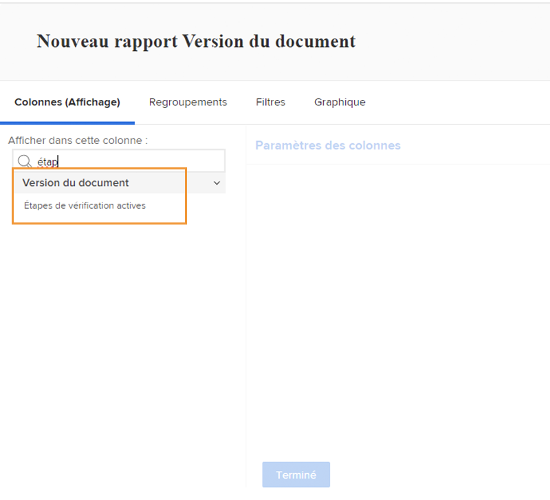
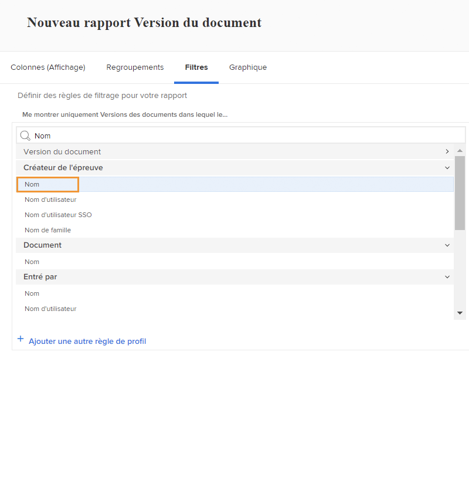

# Rapport sur les bons à tirer

[!DNL Workfront]Les fonctions de vérification digitale de vous permettent de gérer des projets et des workflows de révision associés tous au même endroit — [!DNL Workfront]. Découvrez le travail de vérification effectué avec les types de rapports, les sources de champ et les noms de champ qui affichent les informations de révision et d’approbation.

Nous vous recommandons de travailler avec vos [!DNL Workfront] consultant pour créer des rapports qui répondent aux exigences de votre entreprise. Certains rapports requièrent une connaissance approfondie de la fonction [!DNL Workfront]Rapports du mode texte de .

Commencez par ces rapports standard de base pour aider vos équipes à gérer les BAT lors d’un processus de révision et d’approbation dans [!DNL Workfront].

## [!UICONTROL Approbation d&#39;épreuve]

Ce type de rapport permet de suivre les validations de BAT en cours afin de s&#39;assurer que les délais sont respectés.

![Sélectionner [!UICONTROL Approbation du BAT] de la [!UICONTROL Nouveau rapport] menu déroulant](assets/proof-system-setups-proof-approval-report.png)

Les options d’affichage et de filtrage incluent : [!UICONTROL date de décision], [!UICONTROL validation du BAT], [!UICONTROL étape approbateur], [!UICONTROL modèle de workflow], et [!UICONTROL informations sur le demandeur]. Avec les rapports en mode texte, vous pouvez créer un regroupement qui organise la liste par nom de document. Voir [Comprendre le mode de texte de base pour les regroupements](https://experienceleague.adobe.com/docs/workfront-learn/tutorials-workfront/reporting/intermediate-reporting/basic-text-mode-for-groupings.html?lang=en).

Lors de l’écriture des rapports d’approbation de BAT, assurez-vous d’obtenir des informations relatives à la version la plus récente des bons à tirer. [!DNL Workfront] recommande d’inclure cette source de champ et ce nom de champ dans le filtre :

**[!UICONTROL Approbation du BAT]&quot;[!UICONTROL Is Current Document Version]**

Cela s’avère utile lorsque vous créez des rapports sur des BAT comportant plusieurs versions. De ce fait, le rapport ne répertorie que la version actuelle de chaque BAT qui doit être approuvée. Cela filtre les versions antérieures sur lesquelles vous n’avez plus besoin de travailler.

## [!UICONTROL Version du document]

Ce type de rapport permet de gérer et de suivre les versions dans [!DNL Workfront].

![Sélectionner [!UICONTROL Document Version] de la [!UICONTROL Nouveau rapport] menu déroulant](assets/proof-system-setups-document-version-report.png)

Les options d’affichage incluent des informations provenant de la variable [!UICONTROL version du document], [!UICONTROL document], [!UICONTROL saisi par], [!UICONTROL état de validation du BAT], [!UICONTROL créateur de BAT], et [!UICONTROL fournisseur de documents].

Les regroupements peuvent être effectués par [!UICONTROL version du document], [!UICONTROL saisi par], [!UICONTROL état de validation du BAT], ou les informations sur le propriétaire du BAT.

Les filtres incluent : [!UICONTROL version du document], [!UICONTROL niveau d&#39;accès], [!UICONTROL document], [!UICONTROL saisi par], [!UICONTROL état de validation du BAT], [!UICONTROL créateur de BAT]et des informations sur le fournisseur de documents.

Vous pouvez afficher le nom de la phase de vérification actuellement principale pour chaque document du rapport, avec cette colonne dans une vue :

**[!UICONTROL Versions de document] &quot; [!UICONTROL Principales étapes de preuve]**

Si aucune étape n’est actuellement principale, la colonne est vide.

Ce champ source &quot; nom de champ est également disponible en tant que filtre dans un rapport.

Utilisez la variable [!UICONTROL Créateur de BAT] source de champ pour créer un rapport sur les informations concernant l’utilisateur qui a créé le BAT. Choisissez la [!UICONTROL Nom] source de champ pour afficher le nom du créateur du BAT dans une vue.

**[!UICONTROL Créateur de BAT] &quot; [!UICONTROL Nom]**

Cette combinaison source de champ &quot; nom de champ est également disponible sous forme de filtre.

<!--
Learn More Icon
Learn how to create reports in [!DNL Workfront] with the Report Creation class.
Access to proofing functionality
-->
