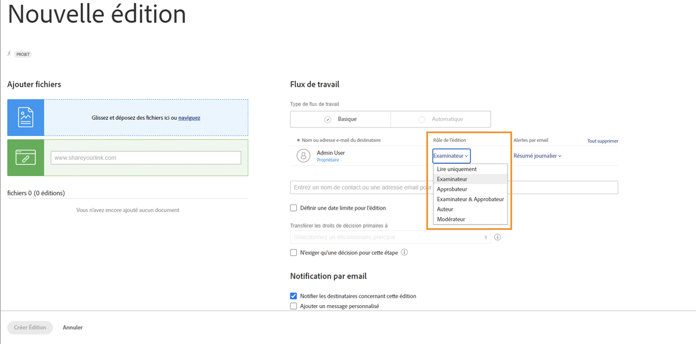
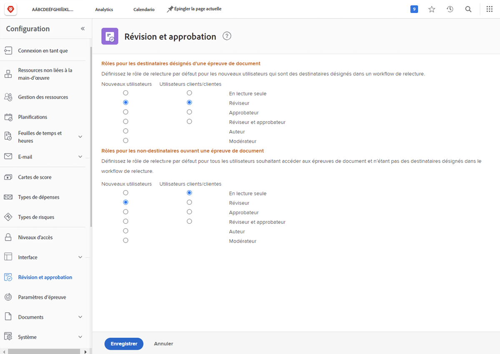

# Définition des rôles de BAT par défaut

<!---
21.4 updates have been made
--->

Le premier paramètre par défaut à effectuer consiste à déterminer un rôle de BAT par défaut qui sera attribué lorsque de nouveaux utilisateurs seront créés ou que des personnes ouvriront un BAT.

Les rôles de BAT déterminent ce qu’un utilisateur peut faire avec un BAT : il suffit de le regarder, de faire des commentaires, de l’approuver, etc. [!DNL Workfront] recommande de définir les valeurs par défaut des rôles de BAT pour tous les utilisateurs, afin de rendre l’ajout de destinataires aux bons à tirer et la configuration des workflows plus rapides et plus facile.

Cependant, ce rôle de BAT par défaut peut être modifié au fur et à mesure du téléchargement des bons à tirer individuels, ce qui permet à chacun de remplir le rôle requis dans le processus de révision et d’approbation.

## Définition des rôles de BAT par défaut

1. Sélectionner **Configuration** de la [!UICONTROL Menu Principal].
1. Sélectionner **Révision et approbation** dans le menu de gauche.
1. Cliquez sur le bouton en regard du rôle de BAT par défaut souhaité pour les deux nouveaux [!DNL Workfront] utilisateurs et utilisateurs invités du BAT pour les &quot;destinataires désignés&quot; : toute personne ajoutée au workflow du BAT, soit manuellement, soit via un modèle de workflow.
1. Cliquez sur le bouton en regard du rôle de BAT par défaut souhaité pour les deux nouveaux [!DNL Workfront] utilisateurs et utilisateurs invités BAT pour les utilisateurs &quot;non-destinataires&quot;. Elles sont généralement [!DNL Workfront] les utilisateurs qui ont accès à un BAT, mais qui ne font pas partie des personnes affectées au workflow.
1. Enregistrez les modifications.

Tenez compte de ce que la plupart de vos utilisateurs et invités seront tenus de faire lorsqu’ils seront ajoutés à un workflow de vérification. Il doit s’agir de votre valeur par défaut.
