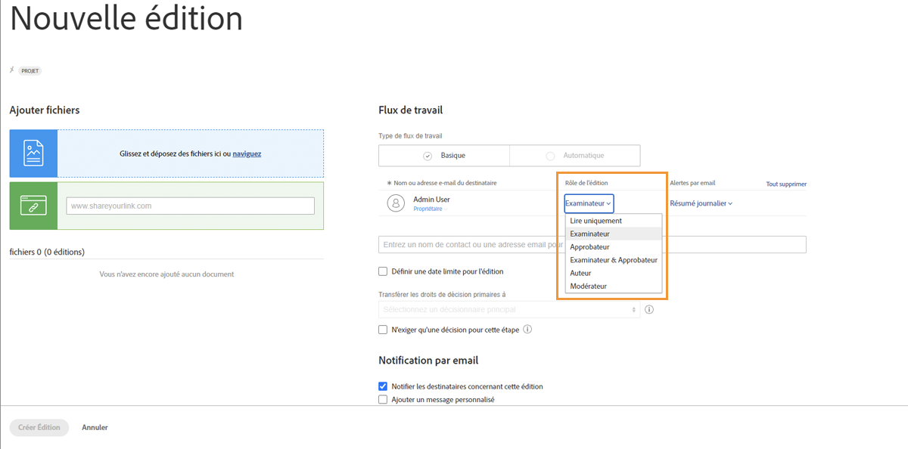
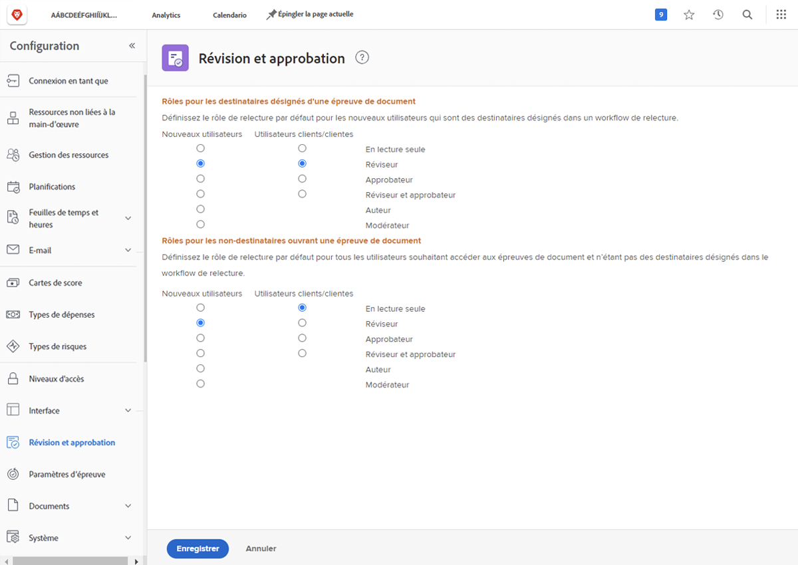

# Définir des rôles de BAT par défaut

Le premier paramètre par défaut à définir est un rôle d’épreuve par défaut qui sera affecté lorsque de nouveaux utilisateurs ou de nouvelles utilisatrices seront créés ou que des personnes ouvriront une épreuve.

Les rôles de BAT déterminent ce qu’un utilisateur peut faire avec une épreuve (la regarder, la commenter, l’approuver, etc.). [!DNL Workfront] recommande de définir les valeurs par défaut du rôle de BAT pour tous les utilisateurs, afin d’ajouter plus rapidement et plus facilement des destinataires aux BAT et de configurer des workflows.

Cependant, ce rôle d’épreuve par défaut peut être modifié au fur et à mesure du chargement des épreuves, ce qui permet à chacun de remplir le rôle requis dans le processus de révision et d’approbation.

## Définir des rôles de BAT par défaut

1. Sélectionnez **Configuration** dans le [!UICONTROL menu principal].
1. Sélectionnez **Révision et approbation** dans le menu de gauche.
1. Cliquez sur le bouton en regard du rôle de BAT par défaut souhaité pour les nouveaux utilisateurs et utilisatrices et pour les utilisateurs et utilisatrices invités de [!DNL Workfront] pour les personnes « destinataires désignées » : toute personne ajoutée au workflow de BAT, soit manuellement, soit via un modèle de workflow.
1. Cliquez sur le bouton en regard du rôle de BAT par défaut souhaité pour les nouveaux utilisateurs et utilisatrices et pour les utilisateurs et utilisatrices invités de [!DNL Workfront] pour les personnes « non destinataires ». Il s’agit généralement d’utilisateurs et d’utilisatrices de [!DNL Workfront] qui ont accès à un BAT, mais qui ne font pas partie des personnes affectées au workflow.
1. Enregistrez les modifications.

Réfléchissez à ce que la plupart de vos utilisateurs, utilisatrices et personnes invitées devront faire lorsqu’ils seront ajoutés à un workflow de relecture. Il doit s’agir de vos paramètres par défaut.

## Bonnes pratiques

| Bonne pratique | Voici pourquoi |
|---|---|
| Utilisez uniquement les rôles Lecture seule ou Réviseur ou réviseuse pour le paramètre « Rôles pour les personnes non destinataires qui ouvrent un BAT de document » dans Workfront. | Les autres options de ce paramètre requièrent toutes un statut de décision du BAT, ce qui peut faire dérailler votre workflow de relecture. En règle générale, les personnes qui n’ont pas été ajoutées au workflow de BAT ont juste besoin de consulter le BAT ou de faire des commentaires, et non de l’approuver, de sorte que les options « Lecture seule » ou « Réviseur ou réviseuse » sont les mieux adaptées.    Remarque : ce paramètre se trouve dans le menu principal de Workfront > Configuration > Révision et approbation. |
