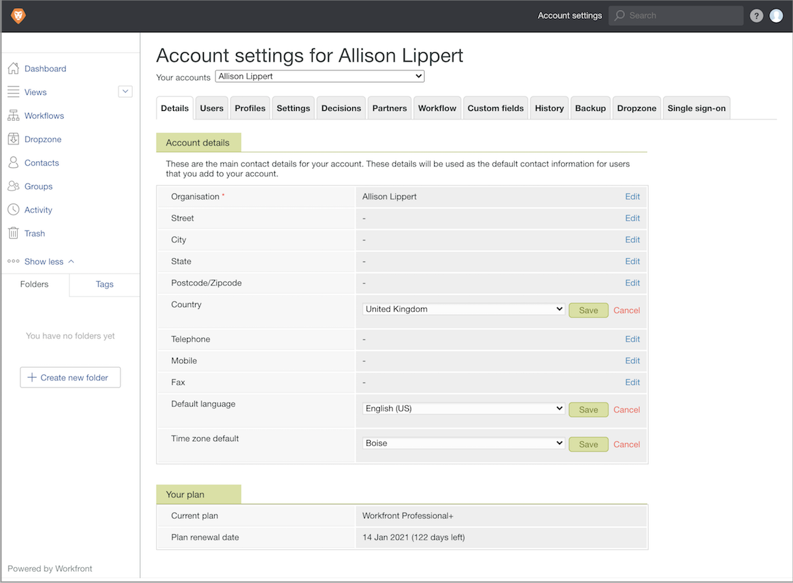

# Configuration des paramètres par défaut du compte du BAT

Définissez les paramètres du compte par défaut qui s’appliquent globalement à tous les utilisateurs de BAT et de BAT (pays, langue et fuseau horaire). Si vous avez des utilisateurs dans plusieurs fuseaux horaires ou pays, vous pouvez ajuster ces paramètres sur le profil utilisateur de chaque individu, si nécessaire.

1. Sélectionner **[!UICONTROL Vérification]** de [!DNL Workfront's] [!UICONTROL Menu Principal].
1. Sélectionner **[!UICONTROL Paramètres du compte]** dans la barre de navigation supérieure.
1. Sélectionnez la variable **[!UICONTROL Détails]** .
1. Accédez à [!UICONTROL Pays] champ et sélectionnez **[!UICONTROL Modifier]**. Choisissez le pays où se trouvent la majorité de vos utilisateurs de vérification par défaut.
1. Sélectionner **[!UICONTROL Enregistrer]** pour ce paramètre.
1. Accédez au [!UICONTROL Langue par défaut] champ et sélectionnez **[!UICONTROL Modifier]**. Choisissez la langue que la majorité de vos utilisateurs de vérification utiliseront par défaut.
1. Sélectionner **[!UICONTROL Enregistrer]** pour ce paramètre.
1. Accédez au [!UICONTROL Fuseau horaire par défaut] champ et sélectionnez **[!UICONTROL Modifier]**. Sélectionnez le fuseau horaire par défaut dans lequel se trouvera la majorité de vos utilisateurs de vérification. Il s’agit du fuseau horaire reconnu par les workflows de BAT configurés manuellement. Il s’applique également aux modèles de workflow de BAT, mais chaque modèle peut avoir un fuseau horaire défini.
1. Sélectionner **[!UICONTROL Enregistrer]** pour ce paramètre.

## Bonnes pratiques

| Bonne pratique | Voici pourquoi : |
|---|---|
| Ajustez les paramètres du serveur principal BAT afin que les utilisateurs voient les échéances sous la forme d’une horloge de 12 heures. | Sélectionnez l’option F j, Y, gi:a dans les paramètres du BAT pour les utilisateurs qui souhaitent afficher les échéances/heures du BAT au format AM/PM. Pour les zones qui utilisent une horloge de 12 heures, cette option permet de clarifier les échéances.    Remarque : ce paramètre est accessible dans le menu principal de Workfront > Vérification > Paramètres du compte > Utilisateurs > et vous pouvez modifier le champ Format de date pour chaque utilisateur. |
| Définissez une date limite de BAT par défaut dans les paramètres du système. | Lorsqu’un délai de BAT par défaut est défini (la date de téléchargement + x nombre de jours ouvrés), si le créateur du BAT oublie d’ajouter une date limite, Workfront applique automatiquement ce délai à chaque BAT transféré.    Remarque : ce paramètre est accessible à partir du menu principal de Workfront > Vérification > Paramètres du compte > Paramètres > Valeurs par défaut du bon à tirer > Délai (+ jours ouvrables). |
| Masquez l’option de décision de BAT non pertinent . | Cette option de décision crée souvent de la confusion parmi les approbateurs, car les organisations ne définissent pas quand l’option Non pertinent doit être utilisée. L&#39;option Non pertinent indique généralement que le BAT n&#39;est pas pertinent pour le destinataire du BAT et qu&#39;il n&#39;est pas nécessaire qu&#39;il prenne une décision approuvée ou rejetée. En sélectionnant Non pertinent, le workflow de BAT peut continuer.   L’option Non pertinent n’est pas nécessaire dans la plupart des workflows de BAT.   Remarque : ce paramètre est accessible dans le menu principal de Workfront > Vérification > Paramètres du compte > Décisions. |
| Ne réorganisez pas les options de décision du BAT dans les paramètres du BAT. | Chaque paramètre de décision de BAT contient une valeur/un poids spécifique qui, s’il est réorganisé, peut prêter à confusion dans vos configurations de BAT. L’ordre de décision et la valeur/le poids sont utilisés comme déclencheurs d’activation de l’étape du BAT et dans les rapports.   Remarque : ce paramètre est accessible dans le menu principal de Workfront > Vérification > Paramètres du compte > Décisions. |
| Définissez les valeurs par défaut des utilisateurs pour les rôles de BAT et les alertes par e-mail. | Ces paramètres sont renseignés automatiquement lors de l’attribution d’un workflow de BAT, de l’accélération du processus et de la cohérence entre les workflows de BAT.   Remarque : les paramètres par défaut de l’utilisateur sont disponibles dans le menu principal de Workfront > Vérification > Paramètres du compte > Utilisateurs > et sélectionnez l’utilisateur pour lequel définir les paramètres par défaut. |
