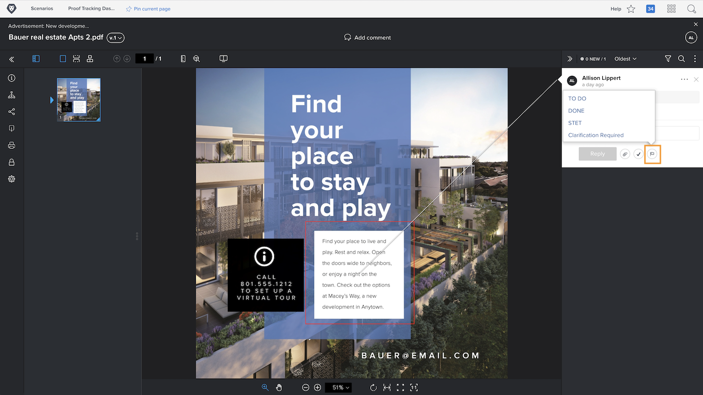

# Gérer les commentaires des BAT

[!DNL Workfront] vous aide à effectuer le suivi et la gestion du travail lié à chaque commentaire sur une épreuve (par exemple, apporter des corrections à la ressource) avec des actions de commentaire ou en résolvant les commentaires.

Les actions des épreuves représentent un « drapeau » ou une « étiquette » sur un commentaire et sont souvent utilisées pour indiquer qu’une action a été entreprise ou doit être entreprise concernant le commentaire. Les actions peuvent être sélectionnées à partir de l’icône ou du menu Plus sur chaque commentaire.

Par exemple, il vous est demandé de choisir quelles corrections, parmi celles qui ont été apportées au cours du processus de révision, doivent être effectivement effectuées. À l’aide d’une action, vous pouvez marquer les commentaires pertinents, ce qui permet à l’équipe de conception ou de rédaction de savoir quelles révisions apporter. Cette équipe peut alors utiliser une autre action pour indiquer que les modifications ont été apportées.

![Une image d’une épreuve dans la visionneuse de relecture avec l’action d’épreuve [!UICONTROL À faire] mise en surbrillance dans le commentaire.](assets/manage-comments-2.png)

Si vous ne voyez pas d’actions répertoriées dans vos commentaires, cela signifie que votre organisation ne les a pas mises en place. Contactez l’administrateur ou l’administratrice de votre système de relecture si vous pensez que les actions peuvent être utiles à votre entreprise.

La fonctionnalité « résoudre le commentaire » est généralement utilisée pour indiquer qu’un commentaire a été traité d’une manière ou d’une autre, qu’une correction a été réalisée ou qu’une réponse a été apportée à une question. Certaines clientes ou certains clients de [!DNL Workfront] « résolvent » un commentaire lorsqu’il s’agit d’une correction qui n’a pas besoin d’être effectuée ou simplement d’un commentaire qui a été lu.

Résolvez le commentaire en cliquant sur l’icône de la coche. Une coche verte s’affiche alors sur le commentaire, ce qui facilite l’identification des commentaires qui ont été examinés à mesure que vous parcourez la colonne des commentaires.

Vous pouvez filtrer la colonne des commentaires selon ces deux fonctionnalités, ce qui vous permet de traiter ce que vous voyez lorsque vous travaillez avec l’épreuve.

![Une image des filtres de commentaire dans la visionneuse de relecture avec les options de filtrage [!UICONTROL Actions] et [!UICONTROL Général] mises en surbrillance.](assets/manage-comments-3.png)

## À vous

>[!IMPORTANT]
>
>N’oubliez pas de rappeler à vos collègues affectés à un workflow d’épreuves que vous travaillez avec des épreuves dans le cadre de votre formation Workfront.

1. Trouvez une épreuve que vous avez chargée dans Workfront. Ouvrez la visionneuse d’épreuves pour consulter les commentaires qui ont été réalisés et répondre à un commentaire. Lorsque vous avez terminé, fermez la visionneuse d’épreuves.
1. Utilisez la section Mises à jour - soit dans les détails du document, soit dans le panneau de résumé - pour afficher les derniers commentaires sur une épreuve que vous avez chargée dans Workfront. Répondez à un commentaire.

<!--
## Learn more
* Create and manage proof comments
-->
