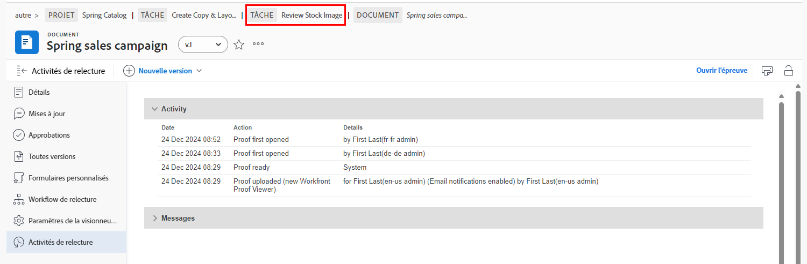

# Présentation des détails du BAT

## Afficher les détails du BAT

En tant que responsable ou propriétaire d’un BAT, vous pouvez approfondir les détails d’un BAT à l’aide du panneau de résumé et de l’ [!UICONTROL Détails du document] page. Commencez par trouver votre BAT dans la [!UICONTROL Documents] d’un projet, d’une tâche ou d’un problème.

### Panneau Résumé

Le panneau de résumé donne un aperçu général des détails de base du BAT. Utilisez l’icône pour développer le panneau lorsque vous en avez besoin et le réduire lorsque vous ne le faites pas. Vous pouvez même survoler la miniature du BAT pour l’ouvrir ou le télécharger.

![Une image de la fonction [!UICONTROL Documents] section d’un projet avec un BAT sélectionné et le panneau de résumé développé. L’icône du panneau de résumé et le panneau de résumé sont mis en surbrillance.](assets/document-summary.png)

Remarque : Le [!UICONTROL Approbations] dans le panneau récapitulatif est réservé à **document** validations et **n’est pas** lié au processus d’examen et d’approbation des BAT que vous avez appris dans ce cours. Les deux processus sont séparés dans [!DNL Workfront].

### [!UICONTROL Détails du document]

Si vous avez besoin d’informations supplémentaires sur le BAT, la variable [!UICONTROL Détails du document] Le lien vous conduit à la &quot;page&quot; du BAT dans [!DNL Workfront].

![Une image de la page du BAT dans [!DNL  Workfront].](assets/document-details.png)

Il est important de noter que la possibilité d’afficher les informations relatives au processus de vérification dépend de vos autorisations de vérification dans [!DNL Workfront].

La page du BAT vous permet d’accéder à ces sections à partir du menu du panneau de gauche :

* **Mises à jour —** Les commentaires effectués dans la visionneuse du BAT apparaissent ici, avec une balise &quot;commentaire du BAT&quot;. Vous pouvez également faire des commentaires sur le fichier, tout comme vous faites des commentaires sur une tâche ou un projet (ces commentaires n’apparaissent pas dans la visionneuse de BAT).
* **Validations —** Cette section concerne les validations de documents, et non les validations de vérification. Les deux types d’approbations sont des processus distincts dans [!DNL Workfront] et ne se relient pas. Si vous utilisez des workflows de BAT pour vos révisions et approbations, vous n’utiliserez pas cette section.
* **Toutes les versions —** Trackez et gérez l’historique des versions du BAT. Il est peut-être plus facile d’accéder à ces informations dans le panneau de résumé du [!UICONTROL Documents] liste.
* **Forms personnalisé —** Les formulaires personnalisés sont utilisés sur les bons à tirer pour capturer des informations spécifiques à l’organisation. Ces informations peuvent être transmises avec le fichier aux systèmes de stockage de documents intégrés, tels que [!DNL Workfront] DAM ou [!DNL Adobe’s] AEM. Les formulaires personnalisés sont configurés par votre [!DNL Workfront] administrateur système ou administrateur de groupe. Contactez votre équipe ou vos administrateurs pour savoir si vous utiliserez des formulaires personnalisés sur des bons à tirer.
* **Workflow de vérification —** Gérez ou modifiez le workflow affecté au BAT. Vous pouvez ouvrir cette fenêtre à l’aide de l’option [!UICONTROL Workflow de vérification] lien sur le BAT dans la [!UICONTROL Documents] également. Découvrez comment apporter des modifications au workflow avec la vidéo Modifier un workflow de BAT .

Regardons de plus près deux des sections : [!UICONTROL Vérification des paramètres de la visionneuse] et [!UICONTROL Activité de vérification].

### [!UICONTROL Paramètres de la visionneuse de relecture]

Ces paramètres vous aident à contrôler l’accès au BAT lui-même.

![Une image de la fonction [!UICONTROL Vérification des paramètres de la visionneuse] de la page du BAT avec la fonction [!UICONTROL Vérification des paramètres de la visionneuse] en surbrillance dans le menu du panneau de gauche.](assets/proofing-settings-on-details-page.png)

* **[!UICONTROL Exiger une connexion. Ce BAT ne peut pas être partagé avec les utilisateurs invités] —** Le BAT ne peut être partagé qu&#39;avec les personnes qui ont une [!DNL Workfront] licence de vérification.
* **[!UICONTROL Exiger que les décisions soient signées électroniquement] —** Lors du partage d’un BAT, cela nécessite que le destinataire dispose d’autorisations de vérification dans [!DNL Workfront] et les fait &quot;signer électroniquement&quot; le BAT en saisissant leur mot de passe de vérification lors de la décision d’un BAT. (Remarque : Le mot de passe de vérification est différent de votre [!DNL Workfront] mot de passe. Le mot de passe de vérification n’est pas facilement accessible. La plupart des destinataires ne connaîtront donc pas ce mot de passe.) [!DNL Workfront] recommande de discuter avec votre [!DNL Workfront] consultant avant d’utiliser cette fonctionnalité.
* **[!UICONTROL Verrouiller le BAT lorsque toutes les décisions requises sont prises ]—** Cela verrouille le BAT à tout commentaire, réponse, décision, etc., une fois que chaque décision sur le BAT a été prise. Cela verrouille toute la version du BAT, et pas seulement une étape spécifique du workflow de vérification.
* **[!UICONTROL Autoriser le téléchargement du fichier d’origine] —** Les destinataires du BAT peuvent télécharger le fichier source d&#39;origine du BAT depuis la visionneuse de BAT (l&#39;option est dans le menu du panneau de droite).
* **[!UICONTROL Autorisation du partage du BAT via une URL publique ou un code incorporé] —** Les destinataires du BAT peuvent partager avec n&#39;importe qui un lien accessible au public.
* **[!UICONTROL Autoriser l’abonnement au BAT via une URL publique ou un code intégré] —** Quiconque reçoit l&#39;URL publique peut s&#39;ajouter au BAT avec son adresse email et son nom (si ce n&#39;est pas un utilisateur du BAT) ou son adresse email et son mot de passe de vérification (si un utilisateur du BAT). (Remarque : Le mot de passe de vérification n’est pas identique à un [!DNL Workfront] password.)

Ces mêmes paramètres peuvent être définis lorsque le BAT est chargé dans la variable [!UICONTROL Paramètres de BAT] , au bas de la fenêtre de chargement.

![Une image de la fonction [!UICONTROL Paramètres de BAT] au bas de la fenêtre de téléchargement.](assets/proof-settings-on-upload-page.png)

### [!UICONTROL Activité de vérification]

Cette page effectue le suivi de toutes les activités qui se sont produites sur le BAT, ainsi que des emails envoyés concernant ce BAT.

![Une image de la fonction [!UICONTROL Activité de vérification] section de la page du BAT avec la fonction [!UICONTROL Activité de vérification] en surbrillance dans le menu du panneau de gauche.](assets/proofing-activity-in-details.png)

Le [!UICONTROL Activité] horodatages de section lorsque des commentaires et des décisions ont été pris, plus qui les a effectués. Il effectue également le suivi lors du démarrage des étapes du workflow de vérification, lorsqu’un destinataire a ouvert un BAT pour la première fois, et d’autres informations qu’un responsable ou propriétaire du BAT souhaite connaître. Ces détails peuvent s’avérer utiles lorsque vous essayez de comprendre des choses comme, par exemple, pourquoi une étape de workflow de vérification n’a jamais été lancée.

Le [!UICONTROL Messages] horodatages lorsque des alertes et des messages électroniques ont été envoyés aux destinataires, qui les a envoyés, et contenu du message. Cela peut s’avérer utile lors de la résolution des problèmes si quelqu’un indique qu’il n’a pas reçu d’e-mail sur un BAT. Vous pouvez vérifier si et quand un email a été envoyé.

[!DNL Workfront] recommande au responsable du BAT et au propriétaire du BAT de se familiariser avec les informations contenues dans ces deux sections. Lorsque vous combinez ces informations à la compréhension de la lecture de la variable [!UICONTROL SOCD] barre de progression, vous pouvez réellement comprendre et gérer vos BAT, quel que soit leur emplacement dans le workflow de vérification.

Une fois que vous avez terminé de travailler dans le [!UICONTROL Détails du document] , utilisez le chemin de navigation pour revenir à la section [!UICONTROL Documents] section du projet, de la tâche ou de l’émission à laquelle le BAT est joint.

<!--
#### Learn more
* [!UICONTROL Document details] overview
* Add a custom form to a document
* Request document approvals
* Summary for documents overview
* View activity on a proof within [!DNL Workfront]
-->
