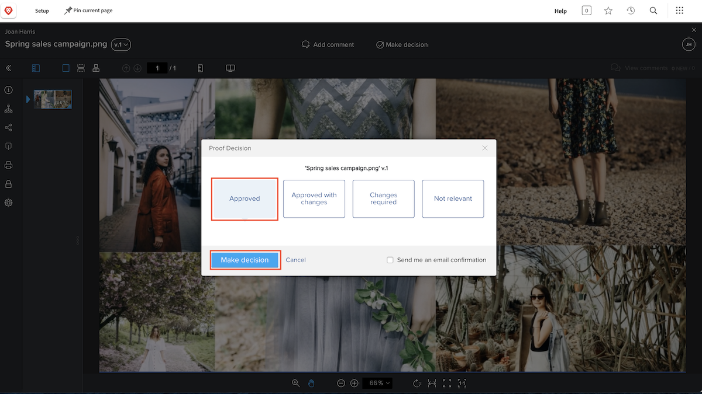

# Vérifier et approuver un BAT

Avant de commencer à vérifier un BAT, assurez-vous de savoir ce que l’on attend de vous. Quel est votre rôle dans le processus de relecture ? Vérifier le BAT, l’approuver, ou les deux ?

En tant que rédacteur ou rédactrice, vous pouvez vous focaliser sur la vérification des BAT afin de détecter les erreurs grammaticales et les fautes d’orthographe. Les équipes de marketing et de création peuvent se concentrer sur la conception de la ressource et s’assurer que l’identité de marque de l’entreprise est respectée. Les équipes juridiques peuvent s’assurer que la manière dont un contrat de services est rédigé est impeccable. Enfin, une personne responsable de projet peut s’assurer que le contenu en cours de vérification respecte l’intention et les objectifs du projet auquel il est associé.

Il se peut que l’on vous demande également d’approuver le BAT. Approuver un BAT signifie que vous dites « Ce travail est prêt à être livré ». Ou peut-être devez-vous dire « Ce travail a besoin d’être modifié, veuillez le renvoyer pour qu’il soit révisé ».

Une fois que vous savez ce que l’on attend de vous, vous pouvez commencer à vérifier un BAT.

## Réception d’un BAT à vérifier

Lorsqu’une ressource est prête à être vérifiée et approuvée, vous recevez une notification par e-mail.

![Image d’un e-mail de nouveau BAT demandant la vérification et l’approbation de deux BAT dans [!DNL  Workfront].](assets/new-proof-emails.png)

Notez que ce lien vers le BAT est unique et vous est propre. Si vous partagez le lien avec quelqu’un, tous les commentaires et balises que cette personne ajoutera seront étiquetés avec votre nom.

L’e-mail [!UICONTROL Nouveau BAT] contient également des informations essentielles sur le BAT :

* Le nom du BAT constitue l’objet de l’e-mail.
* La miniature vous donne un aperçu rapide de ce que vous allez vérifier.
* Le numéro de version vous indique la version du BAT que vous allez consulter.
* Et surtout, la date d’échéance apparaît à deux endroits dans l’e-mail : juste au-dessus de la section des détails du BAT et dans la barre grise correspondant à l’étape du workflow dont vous faites partie.

Une fois que vous pouvez commencer votre vérification, il vous suffit de cliquer sur le bouton bleu [!UICONTROL Accéder au BAT] et le fichier s’ouvre automatiquement dans le visualiseur de BAT de [!DNL Workfront].

### Ouvrir un BAT à partir de l’[!UICONTROL Accueil]

Si vous utilisez [!DNL Workfront] et qu’il vous a été demandé d’approuver une épreuve, vous aurez une affectation dans le widget [!UICONTROL Mes approbations] de l’[!UICONTROL Accueil] [!DNL Workfront].

![Image du widget [!UICONTROL Mes approbations] de l’[!UICONTROL Accueil] [!DNL Workfront].](assets/open-proof-from-home.png)

Notez que les épreuves apparaissent dans l’[!UICONTROL Accueil] de [!DNL Workfront] uniquement si vous êtes responsable de leur approbation. Si vous devez réviser uniquement l’épreuve, elle n’apparaîtra pas dans l’[!UICONTROL Accueil] [!DNL Workfront].

Cliquez sur le lien [!UICONTROL Accéder à l’épreuve] pour ouvrir la visionneuse de relecture.

Selon les workflows de votre organisation en matière de BAT et de projets, il se peut que vous voyiez une affectation de tâche sur l’[!UICONTROL Accueil] de [!DNL Workfront] au lieu d’une demande d’approbation de BAT. Dans ce cas, ouvrez le BAT à partir de la section [!UICONTROL Documents] de la tâche elle-même (reportez-vous ci-dessous pour les instructions).

Vous pouvez également trouver des BAT à vérifier sur un tableau de bord [!DNL Workfront] spécifiquement créé pour votre équipe ou votre organisation afin de faciliter la gestion des workflows de BAT.

### Ouvrir un BAT à partir d’un projet, d’une tâche ou d’un problème

Si vous travaillez habituellement avec des projets, des tâches ou des problèmes dans [!DNL Workfront], vous préférerez peut-être ouvrir le BAT directement à partir de la section [!DNL Documents] de cet élément.

![Image de la section [!UICONTROL Documents] située dans une tâche [!DNL  Workfront] avec le lien [!UICONTROL Ouvrir un BAT]en surbrillance.](assets/open-proof-from-documents.png)

1. Cliquez sur le nom du projet, de la tâche ou du problème.
2. Cliquez sur [!UICONTROL Documents] dans le menu du panneau de gauche sur la page de l’élément.
3. Cherchez le BAT dans la liste des [!UICONTROL Documents].
4. Cliquez sur le lien [!UICONTROL Ouvrir un BAT] pour ouvrir la visionneuse de relecture.

## Comment approuver un BAT

Après avoir ouvert un BAT, vous verrez un bouton **Prendre une décision** en haut, à côté de **Ajouter un commentaire**. Si vous n’êtes pas approbateur ou approbatrice de ce BAT, vous ne verrez pas ce bouton.

Lorsque vous êtes prêt ou prête à prendre une décision, cliquez sur le bouton **Prendre une décision** pour voir les options de décision qui s’offrent à vous. Sélectionnez votre choix, puis cliquez sur l’autre bouton **Prendre une décision** ci-dessous.

## Vérifier et approuver un BAT

Dans cette vidéo, vous apprendrez à :

* Savoir ce que l’on attend de vous lors de l’examen d’un BAT
* Faire un commentaire sur un BAT
* Utiliser des balises pour indiquer les modifications à apporter à un BAT
* Répondre à un commentaire d’épreuve
* Approuver ou refuser une épreuve

>[!VIDEO](https://video.tv.adobe.com/v/335141/?quality=12&learn=on&enablevpops)

<!--
#### Learn more
* Create and manage proof comments
* Make decisions on a proof
* Review a static proof
* Tag users to share a proof
* Notifications for proof comments and decisions
-->

<!--
#### Guides
* Reviewing proofs in [!DNL Workfront]
* -->
