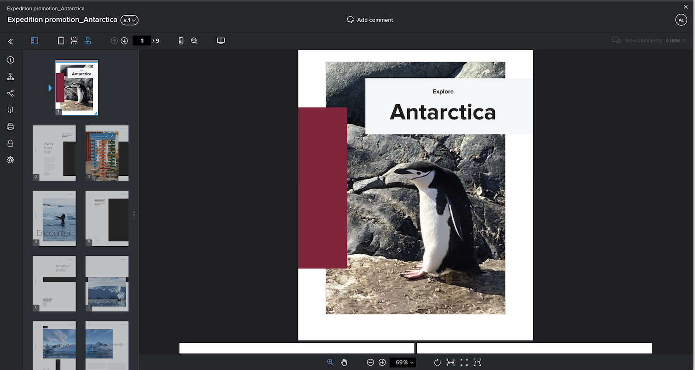

# Combiner plusieurs fichiers en un seul BAT

La combinaison de plusieurs fichiers en un seul BAT peut souvent faciliter le processus de vérification.

L’option &quot;combiner&quot; s’avère utile lorsque des fichiers individuels sont liés ou font partie d’un livrable entier et que tous les fichiers doivent être examinés par les mêmes personnes dans le même délai.

Par exemple, l’équipe créative a conçu une brochure. Quatre concepteurs ont produit les pages et les ont enregistrées en tant que PDF individuels. Si chaque concepteur les téléchargeait comme des bons à tirer individuels, les réviseurs auraient quatre bons à tirer distincts à vérifier. De plus, il serait plus difficile de s&#39;assurer que les morceaux de la brochure s&#39;emboîtent bien.

Solution : demandez à une personne de télécharger tous les PDF et de les combiner en un seul BAT lors du téléchargement. Cela permet aux réviseurs d’afficher le livret dans son ensemble, au lieu des parties déconnectées.

Pour combiner des bons à tirer :

1. Ouvrez le [!UICONTROL Documents] section du projet, de la tâche ou de l’émission à laquelle le BAT doit être joint.
2. Faites glisser les fichiers dans la zone de chargement ou accédez-y. [!DNL Workfront] prend en charge la combinaison de 50 fichiers au maximum.
3. Activez l’option pour [!UICONTROL Combiner tous les fichiers compatibles en un seul BAT].
4. Saisissez le nom du BAT combiné. Ceci est obligatoire.
5. Si vous le souhaitez, vous pouvez modifier l’ordre dans lequel les fichiers seront combinés avec un glisser-déposer dans la liste de téléchargement.
6. Ajoutez des destinataires de BAT, définissez une date limite, etc.
7. Cliquez sur [!UICONTROL Créer un bon à tirer] pour terminer le chargement.

![Une image de la fonction [!UICONTROL Nouveau BAT] avec la liste des fichiers téléchargés et [!UICONTROL BAT unique] sections mises en surbrillance.](assets/combine-proofs.png)

Une fois le BAT téléchargé, il s’affiche sous la forme d’un fichier ZIP dans le [!UICONTROL Documents] .

Aucun autre élément n’est nécessaire pour afficher le fichier combiné. Cliquez simplement sur [!UICONTROL Bon à tirer ouvert] comme d&#39;habitude et le BAT s&#39;ouvre dans la visionneuse du BAT.

## Votre tour

>[!IMPORTANT]
>
>N’oubliez pas de rappeler à vos collègues que vous leur envoyez un bon à tirer dans le cadre de votre formation Workfront.

Recherchez trois ou quatre fichiers (PDF, fichier texte, etc.) sur votre ordinateur.

1. Ouvrez un projet, une tâche ou un problème que vous utilisez pour la pratique pratique dans Workfront.
1. Chargez les fichiers, en les combinant dans un seul BAT.
1. Ajustez l’ordre des fichiers en déplaçant le dernier de la liste pour qu’il soit le premier de la liste.
1. Attribuez le workflow de votre choix (de base ou automatisé) et effectuez le téléchargement.

<!--
##Learn more
* Create a multi-page proof
-->
