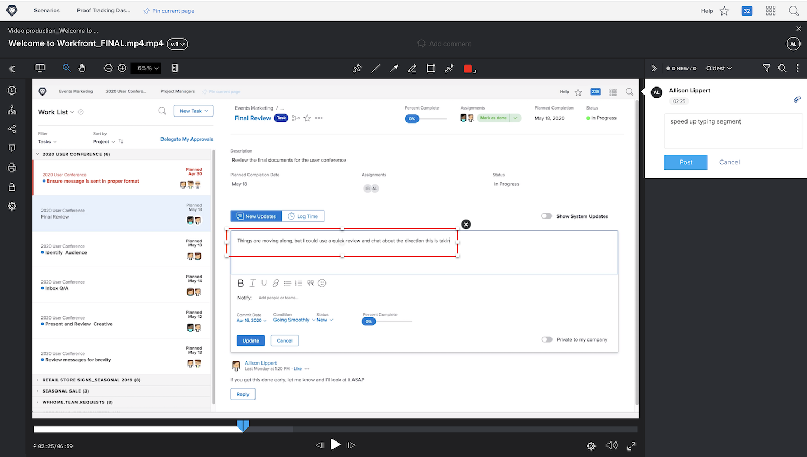

# Charger le BAT d’une vidéo

Les fonctions de relecture de [!DNL Workfront’s] ne sont pas réservées aux fichiers statiques tels que les PDF, les feuilles de calcul ou les images. [!DNL Workfront] prend en charge plus de 150 types de fichiers, y compris des captures vidéo et web d’une taille allant jusqu’à 4 Go.

N’oubliez pas que les fichiers plus volumineux prennent plus de temps à charger. Assurez-vous que votre connexion Internet est stable avant de commencer un chargement volumineux, car une interruption peut interrompre le processus.

<!-- For a complete list of uploadable file types, see the article, Supported proofing file types. -->

La visionneuse de BAT de [!DNL Workfront’s] est l’endroit idéal pour examiner et approuver les fichiers vidéo. Les destinataires des BAT peuvent lire la vidéo directement dans la visionneuse de BAT. Les commentaires sont horodatés, ce qui vous permet de savoir exactement à quelle partie de la vidéo ils se rapportent. Les destinataires des BAT peuvent même utiliser les outils d’annotation et dessiner directement sur la vidéo mise en pause.

Parmi les types de vidéo pris en charge se trouvent MOV, MP4 et H.264. <!-- Check the supported file types list to make sure the video type you use is compatible with Workfront’s proofing features.-->

Le chargement d’une vidéo dans [!DNL Workfront] s’effectue de la même façon que pour un fichier statique.

* Ouvrez le projet, la tâche ou la publication sur lesquels la vidéo doit être chargée.
* Sélectionnez [!UICONTROL **Documents**] dans le menu du panneau de gauche.
* À partir du bouton [!UICONTROL **Ajouter**], sélectionnez [!UICONTROL **BAT**].
* Faites glisser le fichier vidéo dans la zone de chargement ou utilisez la fonction Parcourir.
* Affectez un workflow de base ou automatisé.
* Définissez une date limite.
* Pour terminer, cliquez sur [!UICONTROL **Créer un BAT**].

## À vous

>[!IMPORTANT]
>
>N’oubliez pas d’avertir vos collègues que vous leur envoyez un BAT dans le cadre de votre formation Workfront.

Si vous disposez d’un fichier vidéo, chargez-le dans un projet, une tâche ou un problème d’entraînement dans Workfront. Appliquez un workflow de base ou automatisé, similaire à celui que vous utiliserez normalement, ou appliquez le workflow réel, si vous le connaissez déjà.

